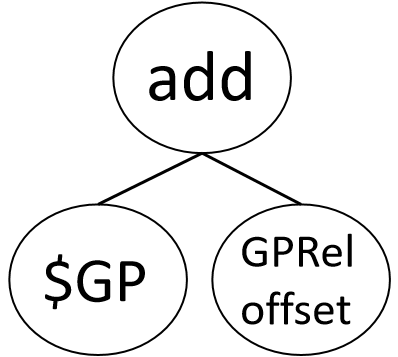
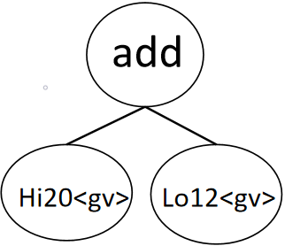
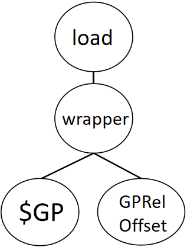
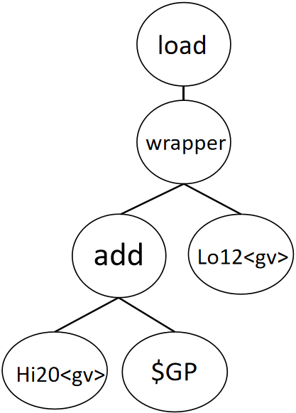
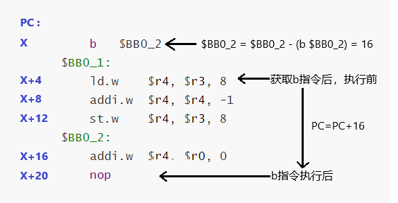

# 序章


## 写在前面

​		LLVM项目开源历史悠久，但是网上却少有对新手友好的开发教程，大多只停留在理论阶段，分析LLVM整体架构和工作原理。一是因为LLVM项目本身十分庞大，又属于底层开发，项目代码错综复杂且时常更改，编写一套完整的免费开发教程所需的精力和时间对于个人来说太过苛刻。二是因为LLVM后端代码的贡献者大多为各指令集架构的公司或LLVM官方人员，就算是为了学习编译器技术，也鲜少有业余程序员会需要从头到尾开发一个新的LLVM后端。

​		虽然LLVM官方也提供了标准的后端开发说明手册，但是其过于晦涩难懂且忽略了太多细节，不适合新手作为自己开发第一个后端的参照，用作开发中关键词查询手册更合适。

​		本文将基于笔者开发LoongArch指令集的LLVM后端项目的经验历程，从代码编写的角度，一步步讲解如何开发一个具有基本功能的LLVM后端。

​		笔者认为，LLVM 后端开发的精髓在于“抄袭与学习”。LLVM官方开发手册中也建议“通过复制其它后端的代码来开发新的后端会是较好的选择”。LLVM项目继承树深度深，分支多，调用关系复杂，在初读LLVM后端代码时很可能会陷入类似于“这个变量类型的父类定义是什么？定义里调用的成员函数来自哪里？成员函数里的依赖约束来源又是哪？”的追踪困境——对于LLVM这样庞大的项目，追根溯源断是不可行的，纠结过深也反而会走一步忘一步，让我们偏离原本的开发重心。更何况LLVM的模块化做得如此出色，就是方便开发者可以不用去管具体的底层实现，直接使用现成的接口。LLVM中大量使用TableGen语言和内置的接口，在开发过程中对于陌生的格式和定义保持“知其然而不知其所以然”的态度即可，将注意力更多地放在新后端的设计上，对于LLVM规范点到即止，将会有助于我们的开发效率。本文将以“能写出代码”为标准，对理解项目所需的必要内容进行讲解，力求范围最小化。

​		一些重要的官方链接：

Loongson官方网站（龙芯中科技术股份有限公司）：

> http://www.loongson.cn/

Loongson与LoongArch的开发者网站（软件与文档资源）：

> http://www.loongnix.cn/
>
> https://github.com/loongson/
>
> https://loongson.github.io/LoongArch-Documentation/

LoongArch指令集架构的文档：

> https://github.com/loongson/LoongArch-Documentation/releases/latest/download/LoongArch-Vol1-v1.02-CN.pdf （中文版）
>
> https://github.com/loongson/LoongArch-Documentation/releases/latest/download/LoongArch-Vol1-v1.02-EN.pdf （英文版）

LoongArch的ELF psABI文档：

> https://github.com/loongson/LoongArch-Documentation/releases/latest/download/LoongArch-ELF-ABI-v2.00-CN.pdf （中文版）
>
> https://github.com/loongson/LoongArch-Documentation/releases/latest/download/LoongArch-ELF-ABI-v2.00-EN.pdf （英文版）

## 开发环境

+ Vmware Workstation 16 PRO - Ubuntu 20.04（虚拟内存12GB，虚拟磁盘200G）
+ ninja 1.10.0
+ gcc 9.4.0
+ clang 10.0.0-4ubuntu1
+ 笔者的虚拟机环境之前已经过系列配置，若您使用的是全新的虚拟机，除上述工具外，可能还需要其它支持软件包，当编译报错时根据报错信息使用`apt install`等方法安装即可。

## Tips

+ 虚拟机的虚拟内存至少需要开到8G，编译时最大并行线程数不要超过4，否则很容易因内存不足而宕机，这时请强制退出然后将最大并行数设为1重试。存储空间至少分配100G，LLVM项目编译后可达到30G。

+ LoongArch与RISCV的相似度极高，可以重点参考RISCV和Mips的代码。在配置环境文件时，可以使用`Ctrl+F`搜索”RISCV“关键词，在相同位置依葫芦画瓢即可。

+ 遇到Bug时，根据报错文件参考其它Target的代码进行修改。无法解决可以上Github的LLVM-project仓库（https://github.com/llvm/llvm-project/issues/）中提交issue，或者上LLVM官方社区论坛（https://discourse.llvm.org/latest）发布问题，一般24h之内就会有人回复。当然，建议在提问之前先通过关键字搜索是否有历史相同问题，大概率存在。

+ 对不同版本LLVM的源代码更改不理解时（例如变量类型的改变），可以通过查询git 提交记录来查看开发者的解释

  	git blame 可以查询该文件的某一行的commit号（如4845531f）
  	git log -1 4845531f 可显示该commit的备注说明

+ 本文存在大量以缩略词命名的代码，为方便理解，请查看附录中的"缩略词索引.md"


# 第一章 新后端初始化与编译

​	本章的任务分为两大部分：

+ 注册新后端。即告诉LLVM”嘿！这儿有个新后端，请带上它一起“，需要修改的是公共部分的代码，均在`llvm/cmake,llvm/include,llvm/lib`下。几乎所有的后端注册的工作都是一样的，修改文件时只需检索”Mips“关键字所在的位置，紧跟着加上LoongArch的信息即可
+ 搭建目标描述框架。这部分是目标独有信息与其它后端独立，均在`llvm/lib/Target/LoongArch`目录下。为了让我们的新后端能够勉强通过编译，我们给它搭建最最基础的目标描述信息（.td文件）及编写CMakeLists。


## 1.1 LoongArch指令集架构简介

​		本节基于龙芯架构32位精简版参考手册，对LoongArch 指令格式和寄存器进行简短的介绍，以便后续编码工作的进行。

### 1.1.1 LoongArch概述

​		LoongArch是一种小端模式的精简指令集架构（RISC），绝大多数指令只有两个源操作和一个目的操作数，采用load/store结构，即仅有load/store访存指令可以访问内存，其它指令的操作对象均是寄存器或立即数。

​		LoongArch指令长度为32位和64位两个版本，本文使用的是32位版本，但龙芯架构具有“应用级向下二进制兼容”的特性，32位版本的应用软件也能在64位版本的机器上运行。


### 1.1.2 寄存器

​		LoongArch基础整数指令涉及的寄存器包括通用寄存器GR和程序计数器PC，如下图所示。


​		32个通用寄存器（GR），记为r0~r31，位宽32-bit。其中0号寄存器r0的值恒为0,1号寄存器r1固定作为存放函数调用返回地址的寄存器。还有一个PC寄存器用于记录当前执行指令的地址，只能被转移指令、例外陷入和例外返回指令简介修改。从架构角度而言，所有基础整数指令中的寄存器操作数可以使用32个GR中的任意一个，但是在实际使用中为了统一规范，通常会指定各类用途的常用寄存器。


### 1.1.3 指令集

​		LoongArch包含3种无立即数的编码格式2R、3R、4R，和6种有立即数的编码格式2RI8、2RI12、2RI14、2RI16、1RI21、I26。下表列举了这9种编码格式的字段分配情况。注意，指令的编码格式与指令的汇编输出不是一回事，例如addi.w的汇编输出为`addi.w $rd, $rj, $imm12`，

而在编码格式中，它的存储域顺序为`addi.w的opcode I12 rj rd`。


​		LoongArch学习Mips使用了SLT和BEQ指令处理条件分支语句，相比ARM的老式CMP指令性能更佳（具体解释请看第7.1节 条件分支语句）。应用级基础整数指令一览如下图所示：


​		绝大多数指令通过指令名中“.XX”形式的后缀来指示操作对象的类型。对于操作对象是整数类型的，指令名后缀.B、.H、.W、.BU、.HU、.WU分别表示该指令操作的数据类型是有符号字节、有符号半字、有符号字、无符号字节、无符号半字、无符号字。特别地，当操作数是有符号数还是无符号数不影响运算结果时，后缀均不带U，但并不代表操作对象只能是有符号数。其它具体指令格式和命名规则请查阅LoongArch32指令手册。


### 1.1.4 指令执行阶段

​		LoongArch架构与Mips架构相同，为五阶段流水线结构，即每条机器指令在工作时必须经历的5个阶段：指令获取、指令解码、执行、内存访问和写回。下面描述了每个阶段处理器负责的工作。

​		1）指令获取（IF）

​			LoongArch从程序计数器PC中获取当前指向的指令，并存入指令寄存器IR中。PC寄存器自增指向下一条指令：PC=PC+4。

​		2）指令解码（ID）

​			控制单元将存储在IR中的指令进行解码，把存储在寄存器中的必要数据发送到算术逻辑单元（ALU）并根据指令中的操作码设置ALU的操作模式。

​		3）执行（EX）

​			ALU使用寄存器中的数据执行控制单元指定的操作。除了store/load指令外，执行结果被保存在目标寄存器中。

​		4）内存访问（MEM）

​			如果是store指令就从寄存器把数据写入内存；如果是load指令就从内存中读取数据到流水线寄存器。

​		5）写回（WB）

​			如果是load指令，就从流水线寄存器将数据写入到寄存器。


## 1.2 LLVM结构

​	为了方便后续内容展开，本节介绍了最基本的LLVM数据结构、算法和机制。

### 1.2.1 前后端分离设计

​		传统的静态编译器是由前端、优化器和后端组成的三段式设计，前端负责生成中间代码，优化器负责进行循环展开等各种运行优化，后端（代码生成器）负责将中间代码映射到目标指令集[5]。由于传统设计的紧密耦合性，当想要更换源语言或目标语言时都必须重新设计全部编译器。而LLVM架构不存在这个问题，LLVM 提供了一套支持多种源语言和目标代码的中间代码LLVM IR。LLVM IR仅由满足静态单赋值（SSA）的指令组成，独立于高级语言和目标指令系统，从而实现了前后端分离（如果您对LLVM IR语言不熟悉，可以查看http://llvm.org/docs/LangRef.html）。程序员可以单独为任何能编译到LLVM IR的源语言编写前端，也可以单独为任何能从LLVM IR编译的目标代码编写后端（如下图所示）。因此，当想要支持新的源语言或目标架构时，只需设计新的前/后端即可。


​		这种可复用性的另一个优点是，比起和预算直接挂钩的专用编译器（例如FreePASCAL)，能够拥有更广阔的程序员贡献群体，从而促进开源项目的优化。同时，新加入的指令集架构，也能一起分享上游社区资源，这对于生态相对薄弱的LoongArch架构来说十分重要。

​		LLVM设计中最重要的就是中间表示IR，它的设计兼容多种高级语言和目标架构，十分适合用于重构和优化。下面展示了一段典型的LLVM IR代码。

```LLVM IR
define i32 @func(i32 %a, i32 %b) {
block:
	%c = alloca i32, align 4
	store i32 0, i32* %c
	ret i32 0
}
```

​		LLVM IR类似一个RISC的低级虚拟指令集，支持跳转标签。其与实际机器指令不同的是，IR不使用固定命名寄存器（因为它没有真实的物理寄存器），而是使用以`%`为标志的虚拟字符命名寄存器，可以无限创建。LLVM IR有两种表现形式，一是人能读懂的文本格式.ll文件，正如上面的代码所示，二是密集存储在磁盘上可高效执行的二进制.bc文件。两种文件均能由LLVM前端Clang生成，LLVM也提供了llvm-dis和llvm-as工具来在两种文件之间进行转换。


### 1.2.2 目标描述文件.td

​		LLVM的模块化设计要求不同的目标架构都能用一种通用的方式来描述各自的特性，如CPU属性、指令格式、寄存器分配约定、模式匹配规则等。LLVM为此提供了一套强类型的，声明式的目标描述语言TableGen语言，用于描述上述信息，其源文件以.td结尾，存放于`llvm/lib/Target/（架构名）`目录下。TableGen语言有类似OOP语言一样的类和继承特性，例如下方的代码定义了一个ADDu指令，继承自3R类型逻辑运算指令，指令操作码为0x11，不检查溢出：

```TableGen
let Predicates = [DisableOverflow] in {
    def ADDu   : ArithLogic3R<0x11, "addu", add, IIAlu, CPURegs, 1>;
}
```

​		TableGen 语法参考教程：https://blog.csdn.net/SiberiaBear/article/details/103539530

​		.td文件的组织方式使得开发人员可以模块化设计他们的目标架构，分别为不同的模块创建一个.td文件，习惯上以`目标架构名+模块名`的方式命名，如Mips中用于描述寄存器类的文件：`MipsRegisterInfo.td`。

​		在理想的情况下，所有目标特定的信息都应该由.td文件描述，但目前的LLVM还无法做到，对于一些复杂的设计，例如地址模式，指令选择等，无法用.td文件描述，需要利用C++来完成。TableGen工具会依据.td文件生成后端描述文件.inc，这些.inc文件与.h/cpp文件加在一起便能提供完整的目标信息，生成模式匹配表，如下图所示。


### 1.2.3 代码生成器

​		为了理解LLVM后端架构，必须弄清CodeGen代码生成器的工作原理。下图来自于

[Tricore_llvm]: ErhardtC.DesignandimplementationofatricorebackendforthellvmcompilerframeworkD.Friedrich-Alexander-UniversitätErlangen-Nürnberg(FAU),2009.

展示了从LLVM IR转换到机器代码所需经过的各个阶段和用来表示中间代码的各种数据结构，每个阶段包含一至多个Pass，一个Pass代表一次具体的分析或转换动作。


​		LLVM代码生成器工作流程分为七个阶段，分别是：指令选择、指令调度和格式化、SSA代码优化、寄存器分配、函数头部/尾部插入、后期机器代码优化、代码发射。

​		1）指令选择

​			将LLVM IR转换为一组可选择的有向无环图（DAG），每个DAG节点代表一条指令。将DAG合法化，把操作和数据类型转换为目标机器支持的native instructions格式（如整数32位扩展）。指令选择器根据合法化的目标DAG执行模式匹配，选择对应的目标机器代码模式。此时操作指令替换为了目标机器指令（如`store`替换为`st`）但操作数仍为LLVM虚拟操作数（如寄存器仍为无限的虚拟寄存器）。

​		2）指令调度和格式化

​			解构目标DAG，将所有指令放入一个有序List，组成**MachineInstrs**，**MachineInstrs**序列组成一个没有分支的基本块**MachineBasicBlocks**，多个**MachineBasicBlocks**组成一个**MachineFunction**，所有**MachineFunction**最终组成一个完整的程序。

​			调度程序根据最小指令周期，最小寄存器压力等原则，优化重排指令序列。如下向内存写入两个整数的代码示例，通过重排指令序列，可以减少寄存器的使用数量。此时对内存地址的操作仍是基于虚拟的栈槽而不是真实的地址。

```LLVM IR
//优化前
%a = add i32 1, i32 0
%b = add i32 2, i32 0
st %a, i32* %c, 1
st %b, i32* %c, 2
//优化后
%a = add i32 1, i32 0
st %a, i32* %c, 1
%a = add i32 2, i32 0
st %a, i32* %c, 2
```

​		3）SSA代码优化

​			在将虚拟寄存器分配到真实物理寄存器之前，代码生成器可以执行一至多个针对SSA形式的代码优化Pass。

​		4）寄存器分配

​			通过图着色法等寄存器分配算法为指令中的虚拟寄存器分配物理寄存器。如果所需寄存器数量大于可分配的寄存器数量，则需要将被占用的寄存器的值暂时保存到内存，该过程成为溢出（spill）。

​		5）函数头部/尾部插入

​			函数头部(Prologue)和函数尾部(Epilogue)是函数调用开始和结束时执行的代码，用于分配和销毁栈空间。根据上一步寄存器的分配和溢出情况计算需要为函数栈帧保留的空间，并将虚拟的栈槽索引映射到相对于栈指针(SP)或帧指针(FP)的偏移的真实内存地址。

​		6）后期机器代码优化

​			类似窥孔优化等各种“最后一分钟”执行的优化Pass

​		7）代码发射

​			将完全转化的机器代码发射。如果是静态编译，则将结果保存为汇编代码文件；如果是JIT（Just In Time）编译，则将结果直接写入内存。


​		想要查看上述阶段的具体Pass，可以使用`llc -debug-pass=Structure`命令（注：不同版本LLVM的Pass序列可能不同）


### 1.2.4 DAG（Directed Acyclic Graph）

​		DAG图是LLVM指令选择模式匹配中最重要的表示方法。DAG图是一个向下生长的树状图，末端（没有子节点）的节点是叶子，其它的为分支节点。分支节点代表操作码，叶子节点代表操作数（寄存器、Const变量、立即数、偏移量）。在.td文件中，一个DAG节点的TableGen语言描述为：`(操作码 操作数，操作数)`。DAG可以嵌套，即一个DAG子树又可以作为另一个DAG的子节点（操作数）。例如机器指令：`op $ra, $rb, $imm16` 的DAG描述为：

```
(set GPROut:$ra, (opNode regClass:$rb, immType:$imm16))
```

其等价DAG图如下：


​		 `set` 是TableGen关键字，是一个赋值操作，相当于“=”，在DAG中它表示匹配形如“`$ra = ...`" 的指令。`(opNode regClass:$rb, immType:$imm16)`是一个DAG树，它嵌套在DAG`(set GPROut:$ra, ...)` 作为一个操作数。指令选择就是将输入的IR DAG转换为特定于目标架构的包含机器代码的合法DAG。综上，若`opNode = add`，则这个DAG图匹配的LLVM IR就是类似于`%3 = add i32 %2, 0`的指令，当遇到符合该形式的IR指令时就按照上面的DAG模式转换成对应的机器指令DAG。

​		为了举例说明，让我们提前看一下指令ADDI.W的定义：

```c++
//LoongArchInstrFormats.td
//<opcode | I12 | rj | rd>
class Fmt2RI12<bits<10> op, dag outs, dag ins, string asmstr, list<dag> pattern, 
               InstrItinClass itin>
    : LAInst<outs, ins, asmstr, pattern, itin> {
  bits<12> imm16;
  bits<5> rj;
  bits<5> rd;

  let Inst{31-22} = op;
  let Inst{21-10} = imm12;
  let Inst{9-5} = rj;
  let Inst{4-0} = rd;
}
```

```c++
//LoongArchInstrInfo.td
//继承LLVM内置Operand类，定义一个12位有符号数类
def simm12 : Operand<i32> {
let DecoderMethod = "DecodeSimm12";
}
//匹配12位有符号数
def immSExt12 : PatLeaf<(imm), [{ return isInt<12>(N->getSExtValue()); }]>;

class ALU_2RI12<bits<10> op, string instrAsm, SDNode opNode,
				Operand od, PatLeaf immType>
    : Fmt2RI12<op, (outs GPR:$rd), (ins GPR:$rj, od:$imm12), 
				!strconcat(instrAsm, "\t$rd, $rj, $imm12"),
				[(set GPR:$rd, (opNode GPR:$rj, immType:$imm12))], IIAlu>{
	let isReMaterializable = 1; //可重构                    
}

// "add" 是IR关键字，定义在 include/llvm/Target/TargetSelectionDAG.td：315。
def ADDI_W : ALU_2RI12<0b0000001010, "addi.w", add, simm12, immSExt12>;
```

​		上面的代码展示了IR节点`add`(定义在llvm/include/llvm/Target/TargetSelectionDAG.td)和机器指令节点`ADDI_W`之间的模式匹配的方法。`(outs GPR:$rd)`和`(ins GPR:$rj, od:$imm12)`两个DAG参数指明，该指令具有三个操作数，其中作为输出的操作数是GPR寄存器集合中的一个寄存器，作为输入的操作数是GPR寄存器集合中的一个寄存器和一个12位立即数。注意，代码中的`$rj $rd`是虚拟寄存器名，最终会映射到**Fmt2RI12**中定义的操作数变量域。

​		以IR节点”`add %2, 0`”为例，在指令选择阶段，它与**ALU_2RI12**中的匹配规则`[(set GPR:$rd, (opNode GPR:$rj, immType:$imm12))]`相匹配，定义中指定了ADDI_W的汇编名称为"addi.w"，指令于是转换为`addi.w %2, 0`。到了寄存器分配阶段，虚拟寄存器`%2`被分配给物理寄存器`$a0`，于是指令又被转换为`addi.w $a0, 0`。定义中还指定了addi.w的指令编码0b0000001010，12位立即数格式的匹配规则immSExt12。上述模式匹配的图解如下：


​		有了这些信息，TableGen就可以自动生成汇编文件和二进制形式的目标文件（ELF文件）。关于指令选择的更多解释请查看：

​		官方文档：https://llvm.org/docs/WritingAnLLVMBackend.html#instruction-set

​		知乎：https://zhuanlan.zhihu.com/p/595518574

​		

## 1.3 注册新后端

​		从本节开始，我们将正式进行代码编写工作，为了读者能够更好理解，请配合代码仓库中的完整代码阅读，代码仓库按照章节划分新增/更改的代码内容，本文只会贴出逻辑说明所必要的部分代码。

​		一个新后端的编写首先应该从让LLVM project 知道这个新后端的存在开始，即告诉LLVM“嘿！我也是一个需要被编译的后端，我在。。。”，让LLVM工具在运行时能查找到并使用新后端。需要注册的信息包括新后端机器的ID和重定位记录。该部分所修改的是所有后端共用的公共文件，只需要模仿别的后端的格式，在相同的地方添加上LoongArch的信息即可。至于为什么修改这些文件，请暂时只当做一种LLVM项目架构规范理解。

+ **llvm/CMakeLists.txt**

  将LoongArch加入LLVM需要编译的Target列表

+  **llvm/cmake/config-ix.cmake**

+ **llvm/include/llvm/ADT/Triple.h**

  **llvm/lib/Support/Triple.cpp**

​		Triple意为三元组，由于典型的指令通常由“操作符 目的操作数 源操作数”三个域组成，所以这个命名习惯被保留了下来。该类用于为目标架构定义特殊行为的配置名称，通俗的讲，就是为不同目标架构的不同版本划分命名域，如LoongArch的不同版本：loongarch32和loongarch64

+ **llvm/include/llvm/BinaryFormat/ELF.h**

  **llvm/include/llvm/BinaryFormat/ELFRelocs/LoongArch.def**（新增）

  **llvm/include/llvm/Object/ELFObjectFile.h**

  **llvm/lib/Object/ELF.cpp**

  ELF (Executable and Linkable Format)是可执行程序、目标代码(object file)、共享库的通用文件格式。文件中定义了LoongArch的ELF文件支持信息。

  ELF.h中新增LoongArch的机器架构识别代号258，虽然在LLVM10项目中该机器代号还未注册，不过该代号将来会被绑定到生成的ELF目标文件中（可使用`llvm-readelf -h XXX.o`指令查看)，正确的代号关系到目标文件能否被龙芯操作系统接收运行，代号与运行环境不匹配将会在链接时报错：“unknown architecture of input file 'test.o' is incompatible with loongarch64 output ”。龙芯的机器架构代号自LLVM15起开始支持，最新的支持代号名单可查看http://www.uxsglobal.com/developers/gabi/latest/ch4.eheader.html。

+ **llvm/lib/MC/MCSubtargetInfo.cpp**

  Subtarget是Target基于不同CPU架构的细分（例如32位和64位的），编译时可以使用`-mcpu=` 和 `-mattr=`命令行选项指定某一个Subtarget。


## 1.4 搭建目标描述框架

​		如1.2节所述，LLVM使用目标描述文件（.td文件）来描述各种特定于目标的信息，这些文件全部存放在`llvm/lib/Target/目标名`下。本节将专注于为LoongArch编写.td文件，实现最基本的寄存器集、指令集和指令模式匹配功能的描述框架，让新后端的编译能够最低限度地通过。编译时，这些.td文件会被TableGen工具转换成C++格式的.inc文件，在.td文件定义的类也会被转换为C++类的形式，从而其它.CPP文件在引用了生成的.inc文件后，便能使用这些类。

+ **LoongArch.td**

  所有.td文件的统领，相当于最顶层的头文件，include了所有Target Machine 相关的描述文件，同时也是Cmake编译的入口。

+ **LoongArchRegisterInfo.td**

  包含了所有LoongArch寄存器的定义。如下代码所示，.td文件主要有两大关键字组成：**class**和**def**。

  + class可以类比为C++的类，`class A<...> : B<...>`代表定义一个类A，并继承类B，A拥有B及B的所有父类的成员变量。**let**为赋值关键字，为父类中已定义的变量再次赋值，若没有let，则说明该变量是此处新定义的。可以使用`let ... in { ... }`为多条记录的同一个变量批量赋值。

  + def 语句生成一条LLVM record（记录），相当于class的一个特定示例，可以同时实现多个class。

    `def ZERO : LoongArchGPRReg<0,  "zero">, DwarfRegNum<[0]>;`

    表示一条名为ZERO的记录，他实现了LoongArchGPRReg和DwarfRegNum类。双尖括号内为类的构造传参，参数类型、顺序和数量与类的定义相匹配。特别地，如果类的构造参数在定义时就赋予了初值，那么在定义def时可以省略该参数，此时def中的参数数量小于类定义的参数数量，但是省略的参数必须是参数序列中尾部的参数（否则编译器无法确定哪个参数被省略）。例如类定义`class A<string id, string name="">`中，name具有初始值（空串），定义时就可以省略name：`def subA : A<"My id">;`。

  + 可以看到，该文件定义了所有寄存器的基类LoongArchReg，并进一步分为通用寄存器、辅助寄存器和输出寄存器。每个寄存器拥有四个身份标识：目标特定的硬件编码Enc，汇编输出名n，寄存器别名AltNames和DwarfRegNum。DwarfRegNum提供从LLVM 寄存器枚举变量到被gcc、gdb等Debug 信息输出器所使用的寄存器编码的映射。
  
    回顾LoongArch指令格式，指令中每个寄存器引用占据5-bit，所以可分配的数值范围为0~31。一旦将0 ~ 31 分配给HWEncoding，TableGen就可以自动获取并设置这个编号。GPROut 包含了所有R21的所有GPR，因此在寄存器分配阶段，R21就不会被分配为输出寄存器。查看编译后生成的LoongArchGenRegisterInfo.inc文件可以看到TableGen打包的寄存器信息。
  
    此处体现了划分命名域的一个优势，由于指定了记录的Namespace，所以不同Target内的寄存器都可以从零开始编号而不会被混淆，例如在C++文件中可以通过`LoongArch::ZERO`来引用LoongArch命名空间中的ZERO寄存器。

```c++

class LoongArchReg<bits<16> Enc, string n, list<string> alt = []> : Register<n> {
  let HWEncoding = Enc;
  let AltNames = alt;
  let Namespace = "LoongArch";
}
// LoongArch CPU Registers
class LoongArchGPRReg<bits<16> Enc, string n， list<string> alt = []> : LoongArchReg<Enc, n>;
// Co-processor Registers
class LoongArchCoReg<bits<16> Enc, string n, list<string> alt = []> : LoongArchReg<Enc, n>;

//===----------------------------------------------------------------------===//
//@Registers
//===----------------------------------------------------------------------===//
let Namespace = "LoongArch" in {
  def ZERO : LoongArchGPRReg<0, "r0", ["zero"]>, DwarfRegNum<[0]>;
  ...
}

//===----------------------------------------------------------------------===//
//@Register Classes
//===----------------------------------------------------------------------===//
def GPR : RegisterClass<"LoongArch", [i32], 32, (add
  A0, A1, A2, ...
  )>;

def CoRegs : RegisterClass<"LoongArch", [i32], 32, (add PC)>;

def GPROut : RegisterClass<"LoongArch", [i32], 32, (add (sub GPR, R21))>;
```

+ **LoongArchInstrFormats.td**

​		按照1.1.3节中的指令格式分类定义了所有指令格式，描述了LoongArch指令集的公共属性，最顶层的LAInst类继承自LLVM内置的Instruction类，以2RI16指令格式为例：

```c++
class Fmt2RI16<bits<6> op, dag outs, dag ins, string asmstr,
        list<dag> pattern, InstrItinClass itin>
: LAInst<outs, ins, asmstr, pattern, itin> {
bits<16> imm16;
bits<5> rj;
bits<5> rd;

let Inst{31-26} = op;
let Inst{25-10} = imm16;
let Inst{9-5} = rj;
let Inst{4-0} = rd;
}
```

​		Fmt2RI16的参数中，op为指令的二进制编码，outs，ins为匹配的DAG节点的输出和输入，asmstr为汇编输出字符串，pattern为模式匹配的Dag节点。itin为指令调度模式，是用来优化处理器指令调度的手段，例如读取或写入数据的时机，资源分配等，目前LoongArch还没有开发这部分处理器功能，此处只留下了一个框架，LLVM会选择缺省的调度方案。Inst 为32位指令域，根据2RI16的指令格式将指令域中各位分配给指令编码、两个寄存器和一个立即数。

+ **LoongArchSchedule.td**

  定义了各种指令调度模式

+ **LoongArchInstrInfo.td**

​		具体到某一条机器指令模式的实现，继承自LoongArchInstrFormats.td中的指令类型，还定义了立即数的格式，内存操作数和地址等操作数格式。目前只定义了内存操作指令store和load、一个加法指令和一个返回指令，以支持最简单的C语言程序（main函数中只有一个return 0）。关于这部分代码的指令模式匹配的具体解释请参照1.2.4节，此处不再赘述。

​		需要特别提出的是，指令中的isPseudo参数用来指明该指令是否是一个伪指令。伪指令代表目标机器架构中并不存在这么一个指令，只是为了统一格式，提高代码可读性的一种手段，通常会结合伪指令扩展（PseudoInstExpansion）来实现指令替换。例如，对于LLVM IR中的无条件跳转指令br和函数返回指令ret，Mips使用寄存器寻址指令`"jr $ra"`来匹配，其指令的输入操作数数量和类型均与IR相同，可以很自然地匹配。但是LoongArch中没有这种格式的跳转指令，只有`"jirl $rd, $rj, offs16"`，如何匹配？JIRL的跳转地址为寄存器rj中的值加上16位立即数offs16逻辑左移2位再符号扩展所得的偏移值，同时将PC+4写入寄存器rd。那么，我们只需令0ffs16恒为零，令寄存器rj为寄存器ra（返回地址寄存器），令寄存器rd为寄存器ZERO（因为我们不关心跳转指令的输出），即可用JIRL指令“假装”成JR指令，实现跳转到函数返回地址的效果。也就是定义伪指令ret，然后把ret通过PseudoInstExpansion扩展成特殊格式的JIRL，实现指令替换。如下代码定义了伪指令PseudoRet，并将其扩展成了JIRL的实现:

```c++
let isReturn=1, isTerminator=1, hasDelaySlot=1, isBarrier=1, hasCtrlDep=1 in
  def PseudoRet  : LoongArchPseudo<(outs), (ins), "", [(LoongArchRet)]>
                  ,PseudoInstExpansion<(JIRL ZERO, RA, 0)>;
```

​		其中，参数isReturn、isTerminator等，皆是跳转指令特定的flag，需要置为1。查看编译后生成的LoongArchGenMCPseudoLowering.inc文件，可以看到扩展的伪指令被替换成JIRL指令的格式然后发射到指令流中。

```c++
switch (MI->getOpcode()) {
    default: return false;
    case LoongArch::PseudoRet: {
      MCInst TmpInst;
      MCOperand MCOp;
      TmpInst.setOpcode(LoongArch::JIRL);
      // Operand: rd
      TmpInst.addOperand(MCOperand::createReg(LoongArch::ZERO));
      // Operand: rj
      TmpInst.addOperand(MCOperand::createReg(LoongArch::RA));
      // Operand: imm16
      TmpInst.addOperand(MCOperand::createImm(0));
      EmitToStreamer(OutStreamer, TmpInst);
      break;
    }
  }
```


+ **LoongArchTargetMachine(.cpp/.h)**

​		LLVMTargetMachine是LLVM代码生成器的基类，包含各种抽象方法，具体实现应由继承它的LoongArchTargetMachine类来完成。目前只需定义一个空的初始化函数。

+ **MCTargetDesc/...**

​		MC层的目标描述文件，描述MC层的寄存器信息、指令信息和指令输出方式等。MC层（Machine Code）是LLVM 中非常低的一层，用于处理汇编、反汇编、目标文件格式以及指令打印等原始机器代码级别的问题，在MC层中不存在常量池、跳转表等高级的表示形式，只存在汇编级的数据结构，例如标签和机器指令。MC层包括指令输出器（MCInstPrinter，给定一个 MCInst，格式化指令的文本表示并将其发送到原生的输出流）、指令编码器（将 MCInst 转换为一系列字节和重定位列表）、指令解析器（TargetAsmParser，输出操作码+操作数列表）、指令译码器(例如将立即数域转换为简单的整数操作数）、汇编解析器（实现了非常重要的MCStreamer API）和汇编程序后端（输出ELF或.o等目标文件）6个组成部分。

​		关于LLVM MC 层的详细介绍请看https://blog.llvm.org/2010/04/intro-to-llvm-mc-project.html

​		至于为什么要创建MCTargetDesc和TargetInfo这两个子目录，只是因为几乎所有后端都采用了这种代码组织结构。在编译之后这两个子目录会在编译路径的lib/目录下生成 : libLLVMLoongArchDesc.a和libLLVMLoongArchInfo.a两个库。

+ **TargetInfo/...**

​		使用TargetRegistry模板为LoongArch目标声明一个全局Target对象，使LLVM目标注册表可以通过目标名或目标三元组来查找该目标：

```c++
Target llvm::TheLoongArchTarget;

extern "C" void LLVMInitializeLoongArchTargetInfo() {
  RegisterTarget<Triple::loongarch, /*HasJIT=*/false>
    X(TheLoongArchTarget, "loongarch", "LoongArch");
}
```

+ **编译脚本**

​		在每个目录下都应该编写相应的CMakeLists.txt和LLVMBuild.txt文件，前者用于cmake执行，后者用于LLVM编译时的辅助指引，主要就是添加该目录下应该编译和应该输出的文件，可以直接移植其它后端的编译文件进行修改。（注：LLVMBuild.txt从LLVM 12开始不再使用）

## 1.5 编译

​		首先，在llvm同级目录下创建一个build文件夹（路径示例如下）

```
~llvm-project-llvmorg-10.0.0
	|- build
	|- llvm
        |- lib
    |- clang
	...
```

​		初始化编译配置，输入命令：

`cmake -DCMAKE_CXX_COMPILER=clang++ -DCMAKE_C_COMPILER=clang -DCMAKE_BUILD_TYPE=Debug -G "Ninja" ../llvm`

​		此处指定了Ninja为编译工具，因为笔者感觉ninja的编译信息更易读，读者也可使用Linux自带的make，只需将`-G`后的选项改为“Unix Makefiles”即可。当终端显示如下信息时，则说明配置文件生成成功。

```
-- Targeting LoongArch
...
-- Targeting XCore
-- Configuring done
-- Generating done
-- Build files have been written to: ...
```

然后使用ninja命令开始编译：`ninja -j4`

`-j4`选项为指定最大同时运行指令数为4（内存小的系统建议调小），第一次编译大概率会遇到语法报错，修复后再次执行`ninja -j4`，即可自动从出错的步骤开始继续编译。如果更改了CMakeList，则需要重新执行cmake命令生成编译初始化设定文件，否则直接执行ninja会报错找不到原来的那个文件。

如果你的机器性能不够理想，请考虑使用下列选项优化编译效率

- **-DLLVM_USE_LINKER=lld** 在基于ELF的平台（例如Linux）上使用lld动态链接器能够显著减少LLVM可执行文件的链接时间。
- **-DLLVM_TARGETS_TO_BUILD=LoongArch** 指定你想要编译的后端
- **-DCMAKE_BUILD_TYPE=Release** 在不需要调试编译器的情况下可以将编译模式从Debug模式换成Release模式。

+ **-DLLVM_CCACHE_BUILD=ON** 在需要rebuild的情况下（例如修改过CMakeLists），可以使用CCACHE加快编译。如果无需rebuild则增量编译就行了（只改了C++文件直接执行ninja即可，会自动识别需要重新编译的文件)。

​		编译前半段可以使用`-j4`，后半段[20xx/27xx]涉及的库较大极有可能因为内存不足而宕机（大概率是在`Linking CXX executable bin/llvm-lto2`这一步），此时输入Ctrl+C中断执行或者强制关机，使用`ninja -j1`，继续编译即可。最坏情况需要5个小时才能完成全部编译。

​		编译完成后，在build/bin目录下执行`./llc --version `，即可获取当前llvm支持的所有后端，其中就可以看见我们新添加的loongarch（如下图所示） 。注：如果指令llc前没加`./`,则调用的是Ubuntu环境中的llvm（如果你之前安装过Ubuntu提供的软件包的话）。


​		现在，编写一个最简单的测试文件test.c，并放到build/bin目录下：

```c
//test.c
int main() {
  return 0;
}
```


​		由于我们的LoongArch后端尚未支持ABI，所以先借助Mips的后端生成.bc文件：

​		`clang -target mips-unknown-linux-gnu -c test.c -emit-llvm -o test.bc`

​		`-emit-llvm`表示生成LLVM IR，生成的test.bc就是LLVM IR的二进制文件。可以使用LLVM自带的反汇编工具llvm-dis将其翻译成可读的文本形式：`build/bin/llvm-dis ch1.bc -o -`不指定输出路径就会将结果直接输出到终端。

​		最后，我们尝试用loongarch后端生成.s文件：

​		`./llc -march=loongarch -relocation-model=pic -filetype=asm test.bc -o test.loongarch.s`

​		这时会收到报错：`Assertion ‘Target && "Could not allocate target machine!"’ failed`

​		报错提示我们并没有定义目标机器，但是这说明LLVM成功调用到了我们新添加的LoongArch后端，只是我们还没编写target machine。本章搭架构的任务到此结束。


# 第二章 后端结构

​		在上一章中我们完成了一个新后端所必需的“表面功夫”，深入到目标机器级别的内容还一无所有。本章将根据LLVM后端继承树的结构逐步实现目标机器架构、汇编输出器、IR DAG到目标机器DAG指令选择、函数首/尾端处理，最终支持main函数只包含一个return语句的C程序 ，能够输出LoongArch汇编代码。本章可能是最为晦涩难懂的一章，因为我们需要打穿IR到机器代码中间的所有流程，逻辑纵穿整个LLVM后端结构，代码量约5000行。话虽如此，这部分的代码在所有的后端中都几乎一样，在实际编程中可大批挪用Mips/RISCV的代码，再进行修改（笔者希望未来的LLVM可以把这些共通的代码移植到公共代码区，不再需要开发人员手动编写）。读者在阅读本章时应将重点放在各成员类的调用关系和DAG模式匹配上，一旦熟悉了LLVM后端结构，就可以十分快速地从零开始构建一个新的后端。


## 2.1 目标机器架构

​		本节新建了大部分LoongArch后端类，关系类图如下所示。


​		Subtarget是较为中心的一个类，LoongArchSubtarget类在构造函数中创建了LoongArchFrameLowering、LoongArchTargetLowering等类的对象，将它们的引用（std::unique_ptr类型）作为成员变量保存了起来，并提供了这些对象的get()接口。大多数类（如LoongArchInstrInfo、LoongArchRegisterInfo）中都会保留一个LoongArchSubtarget的引用对象作为成员变量，从而使用LoongArchSubtarget的接口访问其它类。即使没有保存LoongArchSubtarget的引用，也能通过LoongArchTargetMachine 获取LoongArchSubtarget的引用： `static_cast<const LoongArchTargetMachine &>(TM).getSubtargetImpl()`。一旦获取了LoongArchSubtarget的引用，就可以通过它访问其它类。

​		上文提及过，.td文件会被TableGen工具用来生成.inc文件，从而被其它.cpp文件引用，.inc文件中的类可以被后端类使用和继承，甚至重写其中的函数。这些.inc文件都在Build目录中相应的.td文件的同级目录下。TableGen工具通过模式匹配技术和.td文件配合，使需要编写的后端代码大大减少了。下图展示了这些.inc文件（蓝色）的继承树。


​		LLVM继承树要远深于此，不过暂时浮于表面也能够理解代码逻辑，此处不再深挖。也多亏了LLVM的继承树结构，我们在指令、栈帧和DAG选择中不用实现海量的代码，因为大部分已经被其父类实现。

+ **LoongArchTargetObjectFile(.h/.cpp)**

​		定义了目标文件（ELF文件）的相关规范和初始化函数。不同的编译器对于程序的存储分配策略不尽相同，但是大都符合三段式结构：Text段、Data段和BSS(Block Started by Symbol)段。Text段用于存放代码，Data段用于存放有初始值的数据，BSS段用于存放未初始化的数据。.sdata和.sbss的s前缀代表“small”，该形式使用12位寻址，寻址需要指令数少，能节省ELF文件占用的内存，但寻址空间较小。

+ **LoongArchTargetMachine(.h/.cpp)**

​		定义了目标机器相关特性。实现了龙芯机器基类LoongArchTargetMachine和32位目标机器子类LoongArch32TargetMachine（后续会拓展64位目标机器），提供了ABI接口、Subtarget接口和TargetLoweringObjectFile接口，指定机器为小端模式，指定重定位模式，组装DataLayout字符串。DataLayout是目标机器数据格式的描述，包括指针大小、对齐方式等，LoongArch的DataLayout定义如下。

```c++
"e-m:e-p:32:32-i8:8:32-i16:16:32-i64:64-n32-s128"
```

​		"-"为选项间的分隔符，从左往右，开头的"e"代表小端；"m:e"代表符号压缩格式（mangle）为Linux（Mac为“m:o”)；"p:32:32"代表指针的大小和对齐方式均为32位；"i8:8:32-i16:16:32-i64:64"代表8-bit整数和16bit整数分别向8位和16位对齐，但是尝试向32位对齐，64位整数向64位对齐；"n32"代表机器支持的整数位数为32位，对于X86-64，它支持8、16、32和64位的整数，那么该选项就是"n8:16:32:64"；"S128"代表栈的对齐方式为128位。

​		getSubtargetImpl()方法通过提供的目标机器CPU类型（例如是32位龙芯芯片还是64位的）和特征(features)选项来查找符合条件的Subtarget，如果不存在则创建一个。


+ **LoongArch.td**

​		定义了LoongArch机器特征(Features)，如是否具有Slt指令，是否支持单/双精度浮点数，是否支持二进制翻译扩展等。

​		所有Feature都是LLVM SubtargetFeature的子类，在实际运行中，Features被编码成形如"+attr1,+attr2,-attr3,...,+attrN"的字符串形式，特征前的加号或减号指示（根据CPU配置）应用或者禁用该特征，以逗号分隔。SubtargetFeature类会将该字符串拆分成一个个特征后进行匹配，具体请查看llvm/MC/SubtargetFeature.h。可以通过终端选项  `-mattr=+feature1,-feature2`来指定特征。如下为单精度浮点数特征的定义：

```c++
def FeatureBasicF
: SubtargetFeature<"f", "HasBasicF", "true",
        "'F' (Single-Precision Floating-Point)">;
def HasBasicF
: Predicate<"Subtarget->hasBasicF()">,
AssemblerPredicate<"FeatureBasicF",
"'F' (Single-Precision Floating-Point)">;
```

​		SubtargetFeature的四个参数中，“f"为特征名称，必须小写；"HasBasicF"指定了用于判断是否具有该特征的Predicate；"true"代表默认应用该特征；最后一个参数为特征注释。HasBasicF继承了Predicate类并指定了判断函数hasBasicF()（在LoongArchSubtarget.h中实现）。

​		下面的代码定义了一个loongarch32的处理器，调度模式为LoongArchGenericItineraries，具有FeatureLoongArch32的特征。

```c++
class Proc<string Name, list<SubtargetFeature> Features>
: Processor<Name, LoongArchGenericItineraries, Features>;

def : Proc<"loongarch32", [FeatureLoongArch32]>;
```

​		可以通过终端选项`-mcpu=loongarch32`来指定CPU为loongarch32，也可以输入`-mcpu=help`来查看所有可用的CPU和特征，如下图所示。


​		查看生成的LoongArchGenSubtargetInfo.inc文件以看到TableGen按照顺序依次设置了各个特征的

flag位，这样，所有特征的应用情况就可以用一个长度为12的Bits表示，若相应位为1则表示该特征处于激活状态。

```c++
//LoongArchGenSubtargetInfo.inc
enum {
  FeatureBasicD = 0,
  FeatureBasicF = 1,
  FeatureExtLASX = 2,
  FeatureExtLBT = 3,
  FeatureExtLSX = 4,
  FeatureExtLVZ = 5,
  FeatureLoongArch32 = 6,
  FeatureSlt = 7,
  LaGlobalWithAbs = 8,
  LaGlobalWithPcrel = 9,
  LaLocalWithAbs = 10,
  NumSubtargetFeatures = 11
};
```

+ **LoongArchCallingConv.td**

​		定义了被调用者保存寄存器的集合为RA、FP和S0-S8。被调用者保存寄存器也称为静态寄存器。

+ **LoongArch(SE)FrameLowering(.h/.cpp)**

​		"Lowering"意为下降，在LLVM中代表将IR级别的信息下降（具体实现）到目标机器级别。LoongArchFrameLowering负责栈功能的具体实现，继承自TargetFrameLowering，LoongArchSEFrameLowering为LoongArch Standard Edition（标准版本）LoongArch32的栈功能实现类，继承自LoongArchFrameLowering。虽然目前标准版本只有一个LoongArch32，没必要区分SE，但是考虑将来扩展LoongArch64，还是留下了这个框架，同样，后续的文件也会区分基类版本和SE版本。

​		emitPrologue()和emitEpilogue()用于在函数调用开始和结束时插入内容，具体实现放在后面的章节。LoongArch的栈向下生长，栈中数据可通过栈顶指针加一个正的偏移量来获取，栈中内容如下所示。

```c++
0 ----------
. 函数参数
. 局部数据区
. CPU 的被调用者保存寄存器
. 保存的FP(frame pointer)
. 保存的RA(return address返回地址)
栈空间大小 -----------
```

​		hasFP()函数用于检测当前目标机器是否启用帧指针寄存器FP，通常，栈指针SP会一直指向栈顶，而帧指针FP则指向栈底即数据的入口处，随着数据的变动而移动，如果不启用FP，将会使用SP代替。

​		create()函数创建并返回LoongArchSEFrameLowering的一个对象。

+ **LoongArch(SE)InstrInfo(.h/.cpp)**

​		正如之前提到的，.td文件的设计还不能描述一些复杂的逻辑，需要配合C++文件使用，LoongArch(SE)InstrInfo用于补全LoongArchInstrInfo.td的一些指令信息，目前还没什么实质内容，只定义接口的壳子。

​		GetInstSizeInBytes()获取指令的字节长度(32-bit，4字节)。

​		LoongArchInstrInfo.h通过定义以下代码来从LoongArchGenInstrInfo.inc中提取它需要的内容：

```c++
#define GET_INSTRINFO_HEADER
#include "LoongArchGenInstrInfo.inc"
```

​		这样，LoongArchGenInstrInfo.inc文件中介于`#if def GET_INSTRINFO_HEADER`和`#endif`之间的代码就能被提取使用。

+ **LoongArchInstrInfo.td**

​		新定义了LoongArch.td中新增的Feature的Predicate记录，如：

```c++
def HasSlt          : Predicate<"Subtarget->hasSlt()">;
```

+ **LoongArch(SE)ISelLowering(.h/.cpp)**

​		ISel(Instruction Selection)为指令选择的意思，该类实现了将IR下降为IR SelectionDAG（ISD）的功能，属于DAG合法化阶段，将目标机器不支持的类型和操作转换为支持的类型和操作。

​		文件中定义了LoongArchTargetLowering类，继承自TargetLowering。定义了LoongArchISD节点枚举变量，包括尾调用、32位立即数高/低16位，函数返回等。getTargetNodeName()函数可以根据操作码获取DAG节点的名称。

​		定义了值传递参数（ByValArg）的信息结构体：FirstIdx为第一个寄存器的索引，NumRegs是存放该参数的寄存器的编号，Address为该参数在栈中的地址，即相对于SP/FP的偏移量。

```c++
struct ByValArgInfo {
    unsigned FirstIdx;
    unsigned NumRegs;
    unsigned Address;
};
```

​		在LoongArchSETargetLowering中使用addRegisterClass设置了目标机器支持的寄存器类型：MVT::i32指示该寄存器集为整数32位寄存器，LoongArch::GPRRegClass的定义来自根据LoongArchRegisterInfo.td生成的LoongArchGenRegisterInfo.inc文件，即LoongArchRegisterInfo.td中定义的GPR寄存器集。

```c++
addRegisterClass(MVT::i32, &LoongArch::GPRRegClass);
```

​		为了支持只包含一个return的最简单的程序，此处实现了LowerReturn()用于设置指令的调用规范（如操作数寄存器为RA），将IR Ret转换为LoongArchISD::Ret。

+ **LoongArchMachineFunctionInfo(.h/.cpp)**

​		处理函数相关的内容，目前只定义了传参相关的属性，如栈中函数参数区的首地址和最大栈容量。

+ **MCTargetDesc/LoongArchABIInfo(.h/.cpp)**

​		 ABI(Application binary Interface)是操作系统为运行在该系统上的应用程序提供的二进制接口，可以类比为API。它包含了一系列编程约定，如数据类型、大小、对齐方式、函数参数如何传递以及如何返回等。

​		此处定义了ILP32S、ILP32F、ILP32D和未知，四种ABI规范。ILP32S是针对整数指令操作的规范，使用 32 位通用寄存器和栈传参，其中用于传参的寄存器为A2-A7。

+ **LoongArchSubtarget(.h/.cpp)**

​		Subtarget类是本节的中心，提供各类的调用接口。

​		规定栈对齐方式为8字节。

​		初始化目标机器设定，终端命令"-mcpu"选项处选择的CPU将在这里匹配（默认为LoongArch32），设定机器Features（默认不应用）。

+ **LoongArch(SE)RegisterInfo(.h/.cpp)**

​		同样，用于补充LoongArchRegisterInfo.td中无法描述的逻辑，提供了获取栈帧寄存器、保留寄存器、被调用者寄存器的接口。其中被调用者保存寄存器集合CSR_ILP32S_LP64S_SaveList来自于LoongArchGenRegisterInfo.inc，是llc根据LoongArchCallingConv.td中的CSR_ILP32S_LP64S定义创建的。

+ **编译测试**

​		编译步骤同1.5节，当然别忘了修改CMakeLists。可以在CMake选项中添加-DLLVM_TARGETS_TO_BUILD=LoongArch指定编译目标，加快编译时间。编译完成后在bin目录下执行：

```cmake
./llc -march=cpu0 -relocation-model=pic -filetype=asm ch3.bc -o ch3.cpu0.s
```

会收到新的报错：` Assertion TmpAsmInfo && "MCAsmInfo not initialized. " "Make sure you include the correct TargetSelect.h" "and that InitializeAllTargetMCs() is being invoked!"'`。报错提示我们没有汇编打印器的信息，我们将在下一节实现它。

>
>
>feature 乱码的问题还没弄清，按照https://discourse.llvm.org/t/assertion-subtargetfeatures-hasflag-feature-feature-flags-should-start-with-or-failed/67939的方法用lldb调试一下看
>
>先安装：`sudo apt install lldb`
>
>调成功了就把llvm/lib/MC/MCSubtargetInfo.cpp里的死代码`StringRef("+loongarch32")`改回  `FS/Feature`
>


## 2.2 添加汇编打印器

​		本节实现了LoongArchInstPrinter，继承自MCInstPrinter，用于将MCInst转换为合法的目标机器汇编代码输出。

+ **InstPrinter/LoongArchInstPrinter(.h/.cpp)**

​		定义了指令、寄存器、别名、内存操作数等的打印格式，如下为内存操作数打印格式定义：

```c++
void LoongArchInstPrinter::printMemOperand(const MCInst *MI, int OpNum,
                                      raw_ostream &O) {
    // Load/Store 内存地址操作数 => $reg, imm
    // 打印基址寄存器
    printOperand(MI, OpNum, O);
    O << ", ";
    // 打印偏移立即数
    printOperand(MI, OpNum+1, O);
}
```

​		该方法将会打印出形如`"store $rd, $rj, 8"`格式的汇编代码。

​		printMemOperand()会自动在需要打印内存操作数时调用，因为我们在LoongArchInstrInfo.td中将mem操作数的PrintMethod指定为了"printMemOperand"（如下），Tablegen会根据该信息在.inc文件中生成对该函数的调用。

```assembly
def mem : Operand<iPTR> {
  let PrintMethod = "printMemOperand";
  //操作符为ops的dag值，它用于指定多个子操作数，有子操作数的操作数称为复合操作数
  let MIOperandInfo = (ops GPROut, simm12);
  //编码方法，用于生成OBJ文件时输出编码
  let EncoderMethod = "getMemEncoding"; 
}
```

+ **LoongArchMCInstLower(.h/.cpp)**

​		用于将MI降低到MCInst。MI为LLVM IR经过指令选择后转换成的Triple指令表示形式，MI和MCInst相比只是多包含了一些高级信息，我们只需要在Lower()函数中将操作码和操作数从MI中提取出来放入MCInst的列表即可。

+ **MCTargetDesc/LoongArchBaseInfo.h**

​		定义了MC经常使用的操作数状态标签

+ **MCTargetDesc/LoongArchMCAsmInfo(.h/.cpp)**

​		定义汇编文件格式，如注释符号、字节/半字/字/双字标识等。

+ **MCTargetDesc/LoongArchMCTargetDesc(.h/.cpp)**

​		使用注册方法LLVMInitializeLoongArchTargetMC()注册2.1节新增的Subtarget类、Instruction类...和2.2节新增的InstPrinter类，提供每个类的Create()方法。为loongarch32CPU注册默认Features。

​		下图更直观地展示了MCTargetDesc注册过程的调用关系。

​		createLoongArchMCInstrInfo()实例化LoongArchInstPrinter以实现指令的打印方法。

​		createrLoongArchMCRegisterInfo()初始化定义于LoongArchRegisterInfo.td中的寄存器信息。

​		createLoongArchMCSubtargetInfo()实例化MCSubtargetInfo并初始化LoongArch.td中定义的信息。

​		createLoongArchMCAsmInfo()为TheLoongArchTarger目标注册了LoongArchAsmInfo对象。LoongArchAsmInfo继承自LLVM内置类MCAsmInfo。


+ **LoongArchAsmPrinter(.h/.cpp)**

​		AsmPrinter和InstPrinter的区别在于，InstPrinter将MCInst输出到目标文件，而AsmPrinter是直接将MI发射（从译码阶段变为执行阶段）到文件，不过实际上，在AsmPrinter的发射方法中也是将MI降低到MCInst之后再传到Streamer，Streamer又调用MCInstPrinter的接口。

​		为什么要实现两个打印器呢？正如上文所说，当MI降低到MCInst后，会丢失许多信息，例如用于调试和汇编格式的信息，只剩下本质的操作码和操作数，所以需要另一个打印器来处理MI附带的这些信息。

​		当准备好需要打印的指令之后，就会调起AsmPrinter的EmitInstruction()方法，根据我们上面用LLVMInitializeLoongArchTargetMC()注册的指令和寄存器信息打印出opcode和寄存器名。

+ **LoongArchISelLowering.cpp**

​		设置函数对齐方式为8字节，汇编时会输出`.p2align 3`，即2的3次方字节。若对齐位数不是2的次方，llc命令将会报错。

+ **LoongArchMachineFunctionInfo.h**

​		添加发射".set nora/ra"伪指令的函数，用于指定是否允许在指令别名中使用返回地址寄存器ra。

+ **编译测试**

​		编译步骤同上，CMakeList和LLVMBuild文件内容修改请参考项目代码。

​		输入命令：`./llc -march=loongarch -relocation-model=pic -filetype=asm test.bc -o test.loongarch.s`

​		我们会收到新报错：`./llc: warning: target does not support generation of this file type!`

​		报错提示无法将IR翻译为汇编代码，因为我们还没有实现IR DAG到机器代码DAG的转换，不过后端已经识别到打印器并尝试打印了。


把虚拟机的MC/MCSubtargetInfo copy 到目录下


## 2.3 IR DAG到机器代码DAG

​		2.2节实现了机器代码DAG到汇编代码的转换，本节将实现IR DAG到机器代码DAG的转换。我们需要把IR DAG中的所有节点都合法化，变为目标机器支持的节点。IR DAG到机器代码DAG属于指令选择的一部分，但实际上我们做的工作和“选择”无关，“选择”的工作已经由LLVM 内置的CodeGen工具根据我们提供的.td文件的信息实现了，我们只是继承它的实现类并处理一些特殊情况。

​		使用命令`clang -target mips-unknown-linux-gnu -S test.c -emit-llvm -o test.ll `生成可读格式的IR代码test.ll，来查看都有什么DAG 节点需要处理：

```assembly
define dso_local i32 @main() #0 {
  %1 = alloca i32, align 4
  store i32 0, i32* %1, align 4
  ret i32 0
}
```

​		如上所示，Test.c生成的IR 节点只有stroe和ret，目前LoongArchInstrInfo.td中提供的信息已足够。关于IR DAG的定义请看include/llvm/Target/TargetSelectionDAG.td。

+ **LoongArchTargetMachine.cpp**

​		在pass设置中增加一个指令选择pass：

```c++
bool LoongArchPassConfig::addInstSelector() {
    addPass(createLoongArchSEISelDag(getLoongArchTargetMachine(), getOptLevel()));
    return false;
}
```

+ **LoongArch(SE)ISelDAGToDAG(.h/.cpp)**

​		Select(SDNode *Node)是指令选择的入口，在这里可以针对每个节点可能存在的特殊情况进行自定义，如果没有，则直接将该节点交给SelectCode(Node)，就会选择由.td文件（生成的Cpu0GenDAGISel.inc）决定的默认选择结果。

​		SelectAddr()对帧索引、非对齐寻址等复杂地址操作中的地址操作数做处理。与LoongArchInstrInfo.td中指定的复杂匹配函数是一致的：

```assembly
def addr : 
  ComplexPattern<iPTR, 2, "SelectAddr", [frameindex], [SDNPWantParent]>;
```

​		ComplexPattern的定义如下：

```c++
//llvm/include/llvm/Target/TargetSelection.td
// Complex patterns, e.g. X86 addressing mode, requires pattern matching code
// in C++. NumOperands is the number of operands returned by the select function;
// SelectFunc is the name of the function used to pattern match the max. pattern;
// RootNodes are the list of possible root nodes of the sub-dags to match.
// e.g. X86 addressing mode - def addr : ComplexPattern<4, "SelectAddr", [add]>;
//
class ComplexPattern<ValueType ty, int numops, string fn,
list<SDNode> roots = [], list<SDNodeProperty> props = []> {
ValueType Ty = ty;
int NumOperands = numops;
string SelectFunc = fn;
list<SDNode> RootNodes = roots;
list<SDNodeProperty> Properties = props;
}
```

​		LoongArchSEISelDAGToDAG留下了loongarch32版本特性框架，这种子版本设计上文已说明过。

+ **编译测试**

​		输入命令：`./llc -march=loongarch -relocation-model=pic -filetype=asm test.bc -o`

`test.loongarch.s`

​		新报错：

```assembly
LLVM ERROR: Cannot select: t6: ch = Cpu0ISD::Ret t4, Register:i32 $lr
  t5: i32 = Register $lr
  In function: main
```

​		新报错提示无法选择Ret指令，因为我们还没有完成Ret的寄存器操作数和返回值的处理。

## 2.4 return指令寄存器

​		使用命令：`/llc -march=mips -relocation-model=pic -filetype=asm test.bc -o -`可以查看Test.c生成的Mips汇编代码:

```
main: # @main
...
\# BB#0:
addiu $sp, $sp, -8
...
jr $ra
...
.end main
```

​		可以看到，Mips使用`"jr $ra"`指令来处理return指令，寄存器ra是Mips架构中存放返回地址的专用寄存器，类似的，在LoongArch中我们使用指令`"jirl $rd, $rj, simm16"`来处理return指令：

```assembly
def : InstAlias<"jr $rj",                (JIRL      ZERO, GPROut:$rj, 0), 3>;
```

​		在上一节中，我们已经创建了匹配的机器代码DAG，但是还需解决两个问题：一，如何让LLVM将函数调用的返回地址保存在LoongArch指定的返回地址寄存器RA中；二，如何让LLVM在为虚拟寄存器分配物理寄存器时将指令中的虚拟寄存器rj映射到RA。

+ **LoongArchCallingConv.td**

​		指定返回值寄存器为A0、A1

+ **LoongArchISelLowering(.h/.cpp)**

​		实现了return指令的下降函数LowerReturn()，将ISD::ret下降为LoongArchISD::Ret，将DAG中的返回值（注意区分返回值和返回地址）复制给A0寄存器之后更新DAG的数据依赖链。如果此处不将A0关联到数据流上，在后边的优化Pass中，由于Ret使用的是RA寄存器，会误认为A0寄存器无用，从而把CopyToReg节点删掉，导致返回值出错。

​		其中analyzeReturn()用于处理返回值信息，检测是否符合ABI要求。"sret"是子程序返回指令的缩写。

+ **LoongArchMachineFunctionInfo.h**

​		添加了值传参和返回值寄存器相关的函数，以及若干控制返回状态的flag。

+ **LoongArchSEInstrInfo(.h/.cpp)**

​		实现伪指令RetRA展开，使用LoongArch::RET作为指令，RA为返回地址寄存器。

+ **编译测试**

​		查看2.3节中生成的.ll文件，发现IR中存在一条Store语句，由于我们尚未实现store指令，为了使汇编输出成功，可以在编译时使用O2级别优化选项生成只留下一个`ret`的简单lllvm IR程序用于检验我们的成果：	`clang -O2 -target mips-unknown-linux-gnu -c ch2.c -emit-llvm -o ch2.bc`。

​		使用llc指令输出汇编代码，不指定输出路径可以直接输出到终端显示：

​	`build/bin/llc -march=cpu0 -relocation-model=pic -filetype=asm ch2.bc -o -`

```assembly
	.text
	.section .mdebug.abi ilp32s
	.previous
	.file	"test.c"
	.globl	main                    # -- Begin function main
	.p2align	3
	.type	main,@function
	.ent	main                    # @main
main:
	.frame	$r3,0,$r1
	.mask 	0x00000000,0
	.set	noreorder
	.set	nomacro
# %bb.0:
	addi.w	$r4, $r0, 0
	jr	$r1
	.set	macro
	.set	reorder
	.end	main
$func_end0:
	.size	main, ($func_end0)-main
                                        # -- End function
	.ident	"clang version 10.0.0-4ubuntu1 "
	.section	".note.GNU-stack","",@progbits
```

​		能看到，已经正常生成了 `jr	$r1` 指令。也能看到返回值 0 通过 `addi.w	$r4, $r0, 0` 这条指令放到了寄存器 `$r4` 中，`$r4` 就是 `A0`。

​		汇编代码中的各种以“."开头的伪指令释义如下，在后续的章节会详细解释。

```c
.text 						//声明代码段
.p2align 3      			//声明对齐方式2的3次方字节
.global main    			//声明全局符号
.type 						//指定符号的类型，“.type main,@function”表示main为函数
.section  @声明节名
..section .mdebug.abi ilp32s//使用的ABI为ILP32S
.flie 						//源文件名
.size 						//设定指定符号的大小。“.size	main, ($func_end0)-main”表示main函								//数地址块大小为标签“func_end0”的地址减去标签“main”的地址
.ident 						//编译环境标识，无实际意义
.frame						//声明栈寄存器，栈空间大小和返回地址寄存器
.mask						//寄存器掩码
```

​		

​		为了捋清从IR到LoongArch汇编的转换过程，我们指定 `-print-before-all` 和 `-print-after-all` 参数，打印出指令在各个Pass执行前后的状态：

​	`build/bin/llc -march=cpu0 -relocation-model=pic -filetype=asm -print-before-all `

​	`-print-after-all ch2.bc -o -`

​		从打印出来的信息可以看到，在selection DAG合法化阶段，LLVM遇到`ret`关键字时就调用LoongArchISelLowering.cpp中的`LowerReturn()`方法，创建我们自定义的DAG节点`LoongArchISD::Ret`加入DAG图中；在指令选择阶段，`LoongArchISD::Ret`被伪指令RetRA代替；在Post-RA伪指令拓展阶段，根据LoongArchSEInstrInfo.cpp中的`expandPostRAPseudo()`将RetRA扩展为`LoongArch::RET $ra`。最后在汇编输出阶段，将`LoongArch::RET`根据LoongArchInstroInfo.td（实际上是TableGen根据该.td生成的.inc）中定义的翻译成`jr $ra` 。

​		返回值常量0被根据`def : Pat<(i32 immSExt12:$in),(ADDI_W ZERO, imm:$in)>;`的匹配模式转换成“`addi.w	$r4, $r0, 0`”。


## 2.5 函数头/尾

​		本节实现函数调用时的内存相关的操作，主要包括栈的创建和销毁、栈内变量的存储、复杂地址计算以及函数头和函数尾代码插入。

​		函数调用开始和结束时的堆栈和寄存器等信息通常只能在运行时才能确定，不能通过死代码用TableGen静态生成。用于声明这些信息的段落称为函数头（Prologue ）和函数尾（Epilogue ），它们在所有指令翻译完后才执行插入，不属于指令翻译的一部分，而是堆栈使用的约定，例如由ABI指定的被调用者保存寄存器必须在进入函数时将值保存到内存，并在退出函数时从内存中恢复。


### 2.5.1 栈相关操作

+ **LoongArchSEFrameLowering(.h/.cpp)**

  实现发射函数头尾的函数：emitPrologue()和emitEpilogue()。

  + emitPrologue()

    获取栈信息，通过根据栈的大小减小栈指针SP，为函数开辟栈空间；将被调用者保存寄存器保存到栈中；遍历指令列表，找到最后一个保存被调用者寄存器的值到内存的指令的下一条指令，然后为每个被调用者保存寄存器输出.cfi_offset伪指令。指令`.cfi_offset register, offset`指示寄存器register的上一个值被保存在了CFA中偏移量为offset的地方，相当于*(CFA + offset) = register(pre_value)。.cfi_startproc和.cfi_endproc是每个函数的入口和结束处的标签。

  + emitEpilogue()

    将被调用者保存寄存器的先前值复原，并根据栈大小增加栈指针，销毁栈空间。不过RA、FP这些寄存器其实也是上文环境的一部分，在执行return指令的时候会被隐式地清理，所以这里我们只需要调整栈空间就行了。

  + hasReservedCallFrame()

    由于栈操作指令中立即数最大为16位，所以需要检测最大栈空间偏移是否小于16位立即数且栈中无可变大小的数据结构。

  + determineCalleeSaves()和 setAliasRegs()

    当需要的虚拟寄存器数目大于空闲的物理寄存器数目时，就必须将一些被占用的物理寄存器溢出（spill）到内存中。这两个函数就是用于在插入函数头/尾之前判断需要溢出的被调用者保存寄存器，LLVM提供了一个RegScavenger类来负责这项工作。

+ **LoongArchMachineFunctionInfo.h**

​		添加与return指令和堆栈有关的属性的set/get方法，例如最大栈空间，是否调用LLVM异常处理内置函数等。

+ **LoongArchSEInstrInfo(.h.cpp)**

​		应emitPrologue()为本地变量开拓栈空间的需要，实现调整栈指针的函数adjustStackPtr()，即将栈指针加上栈大小（负数）：`addi.w $SP, $SP, -stacksize`，类似的，当函数调用结束销毁栈空间时，emitEpilogue()将输出`addi.w $SP, $SP, stacksize`。

​		但是我们的加法指令ADDI.W只支持12位立即数，如果偏移量大于12位立即数的范围，则无法只用一条指令完成SP的加法，所以又增加了loadImmediate()辅助方法来在offset较大时结合使用LU12I.W和ORI指令，将超过12位的立即数加到寄存器中。其中使用了R21保留寄存器作为临时辅助寄存器进行计算。

+ **LoongArchInstrInfo.td**

​		添加有/无符号12/20位立即数的匹配规则，LU12I.W和ORI指令描述，以及处理大立即数的指令组合方式：LU12I.W负责加载高20位立即数，ORI负责加载低12位立即数。

​		注意，在没有另行指定优先级的情况下，当某条指令同时符合多条匹配规则时，LLVM会根据.td文件中规则的出现顺序选择第一条符合的规则。对于不超过12位的立即数，ORI和ADDI_W显然都能处理，为了让编译器选择ADDI_W指令而不是ORI指令，定义时需要注意将ADDI_W放在ORI前面。

```assembly
// 小立即数的处理方式
def : Pat<(i32 immSExt12:$in), (ADDI_W ZERO, imm:$in)>;
def : Pat<(i32 immZExt12:$in), (ORI ZERO, imm:$in)>;
def : Pat<(i32 immLow12Zero:$in), (LU12I_W (HI20 imm:$in))>;

// 适合任意立即数的处理方式
def : Pat<(i32 imm:$imm), (ORI (LU12I_W (HI20 imm:$imm)), (LO12 imm:$imm))>;
```

​	

### 2.5.2 本地变量存储操作

+ **LoongArchRegisterInfo.cpp**

​		由于到了低级的MCInst层后，栈空间大小等高级信息已经消失，所有参数的引用都是一个负数的帧索引（Frame Index)，指向一个虚拟的栈槽（例如-4，-8）。我们需要将该帧索引删除，替换为等价的“寄存器-偏移”对，来计算参数的真实地址。

​		在“指令选择”和“寄存器分配”pass完成后，对于每一条引用了栈槽中的数据的指令，都会调用eliminateFrameIndex()方法，通过`spOffset = MF.getFrameInfo()->getObjectOffset(FrameIndex)`计算对象相对于栈指针SP的相对偏移，以`$SP, offset`的形式表示其真实地址。

​		其中，输出参数、指向动态分配的栈空间的指针和全局寄存器，本就总是以相对于SP的方式引用的，不需要进行该转换；而输入参数、被调用者保存寄存器和局部变量等则需要进行转换。


+ **LoongArchInstrInfo(.h.cpp)**

​		声明寄存器的内存读取、入栈操作的方法storeRegToStack()和loadRegFromStack()。实现内存操作数的构造方法。

+ **LoongArchSEInstrInfo(.h/.cpp)**

​		storeRegToStack()方法负责实现寄存器分配阶段的寄存器溢出（spill）操作。通过和LoongArchInstrInfo.td中定义的ST_W和LD_W绑定，实现将寄存器值保存入栈和从栈内读取数据到寄存器的功能。

​		由于局部变量的地址是由一个帧索引指定的，所以在storeRegToStack()中它们对应的虚拟寄存器的偏移均为零。

+ **LoongArchAnalyzeImmediate(.h/.cpp)**

​		这里使用了递归设计，通过ADDI_W、ORI、SLLI_W和LU12I_W指令的组合加载任意位的立即数到寄存器，并从所有组合中选择指令数最少的一种替换原指令序列。选择指令的原则如下：

​		若立即数不超过12位，则使用ADDI_W；若立即数的低12位为零，则使用SLLI_W；若指令序列以ADDI_W和SLLI_W开头，SLLI_W移动位数不小于12位且移位后不超过32位，则用一条LU12I_W指令等价替换这两条指令。还可以根据需要指定指令序列的最后一条指令为ADDI_W或SLLI_W或ORI。

​		下表以调整栈指针为例，展示了加载不同大小的立即数（栈大小）的指令序列（r3为SP，r21为临时寄存器，栈地址以8字节对齐）：

| 栈空间地址范围    | 栈大小     | 函数头（创建栈）                                             | 函数尾（销毁栈）                                             |
| ----------------- | ---------- | ------------------------------------------------------------ | ------------------------------------------------------------ |
| 0~0x07D0          | 0x07D0     | `addi.w $r3, $r3, -2000`                                     | `addi.w $r3, $r3, 2000`                                      |
| 0x0800~0x0ff8     | 0x0800     | `addi.w $r3, $r3, -2048`                                     | `addi.w $r21, $r0, 1`<br>`slli.w $r21, $r21, 12`<br>`addi.w $r21, $r21, -2048`<br>`add.w $r3, $r3, $r21` |
| 0x1000~0xfffffff8 | 0x7ffffff8 | `addi.w $r21, $r0, 8`<br>`slli.w $r21, $r21, 28`<br>`addi.w $r21, $r21, 8`<br>`add.w $r3, $r3, $21` | `addi.w $r21, $r0, 8`<br/>`slli.w $r21, $r21, 28`<br/>`addi.w $r21, $r21, -8`<br/>`add.w $r3, $r3, $21` |
| 0x1000~0xfffffff8 | 0x90008000 | `addi.w $r21, $r0, -9`<br/>`slli.w $r21, $r21, 28`<br/>`addi.w $r21, $r21, -32768`<br/>`add.w $r3, $r3, $21` | `addi.w $r21, $r0, -28671`<br/>`slli.w $r21, $r21, 16`<br/>`addi.w $r21, $r21, -32768`<br/>`add.w $r3, $r3, $21` |

​		之后，ReplaceADDI_WSLLI_WWithLU12I_W()会把指令序列开头的`addi.w`和`slli.w`替换成一个`lu12i.w`，例如：

| 栈空间地址范围    | 栈大小     | 函数头（创建栈）                                | 函数尾（销毁栈）                                 |
| ----------------- | ---------- | ----------------------------------------------- | ------------------------------------------------ |
| 0x0800~0x0ff8     | 0x0800     | `addi.w $r3, $r3, -2048`                        | `ori $r21, $r0, 2048`<br>`add.w $r3, $r3, $r21`  |
| 0x1000~0xfffffff8 | 0x90008000 | `lu12i.w $r21, 458744`<br>`add.w $r3, $r3, $21` | `lu12i.w $r21, 589832`<br/>`add.w $r3, $r3, $21` |


+ **编译测试**

  为了测试栈空间较大时的地址计算功能，我们在上一节的C程序中添加一个超大数组的定义：

  ```c
  int main() {
  	int a[0b11111110011010101100111];
  	return 0;
  }
  ```

  

  对应的LLVM IR：

  ```assembly
  define dso_local i32 @main() #0 {
    %1 = alloca i32, align 4
    %2 = alloca [8336743 x i32], align 4
    store i32 0, i32* %1, align 4
    ret i32 0
  }
  ```

  编译输出LoongArch汇编代码：

  ```assembly
  main:
  	.frame	$r22,33346976,$r1
  	.mask 	0x00000000,0
  	.set	noreorder
  	.set	nomacro
  # %bb.0:
  	lu12i.w	$r21, 65534
  	addi.w	$r21, $r21, 51
  	slli.w	$r21, $r21, 12
  	addi.w	$r21, $r21, -1440
  	add.w	$r3, $r3, $r21
  	addi.w	$r4, $r0, 0
  	st.w	$r4, $r3, 33346972
  	lu12i.w	$r21, 2
  	addi.w	$r21, $r21, -51
  	slli.w	$r21, $r21, 12
  	addi.w	$r21, $r21, 1440
  	add.w	$r3, $r3, $r21
  	jr	$r1
  	.set	macro
  	.set	reorder
  	.end	main
  ```
  
  可以看到栈帧调整的指令和地址计算的指令都正常运行了。

+ 可通过如下指令查看pass的执行流程`./llc -march=cpu0 -relocation-model=pic -filetype=asm ch2.bc -debug-pass=Structure -o -`，更多信息在CodeGen/Passes.h中。

```txt
Target Library Information
Target Pass Configuration
Machine Module Information
Target Transform Information
Type-Based Alias Analysis
Scoped NoAlias Alias Analysis
Assumption Cache Tracker
Profile summary info
Create Garbage Collector Module Metadata
Machine Branch Probability Analysis
  ModulePass Manager
    Pre-ISel Intrinsic Lowering
    FunctionPass Manager
    ...
    Rewrite Symbols
    FunctionPass Manager
      ...
      LOONGARCH DAG to DAG Pattern Instruction Selection
      ...
      Optimize machine instruction PHIs
      ...
      Local Stack Slot Allocation
      Remove dead machine instructions
      ...
      Peephole Optimizations
      Remove dead machine instructions
      ...
      Machine Instruction Scheduler
      ...
      Greedy Register Allocator
      ...
      Prologue/Epilogue Insertion & Frame Finalization
      ...
      LoongArch Assmebly Printer
      ...

```


# 第三章 算术和逻辑运算指令

​		本章实现了用于处理+、-、×、÷等算术运算和!=、|、&等逻辑运算的指令。这些运算符的相应的IR指令在龙芯指令集中几乎都有相同功能的机器指令，只需在.td文件中描述其一对一的映射即可，不需要指令扩展。

​		本章的重点在于C程序操作数和IR指令的映射关系，以及如何用.td文件描述更复杂的指令规则。


## 3.1 算术运算指令

​		本节实现了+、-、*、/、%、<<和>>运算。

+ **LoongArchSubtarget.cpp**

​		定义了是否检测算术运算溢出情况的flag，默认不启用，当算术运算溢出时截断运算结果。可在llc命令后添加`-loongarch-enable-overflow=true`选项启用，当算数运算溢出时抛出异常。大部分处理器对溢出的默认处理都是直接截断，启用溢出异常抛出可帮助开发人员调试程序。但是目前龙芯处理器尚未支持整数运算溢出异常抛出，只支持浮点运算溢出异常抛出。

+ **LoongArchInstrInfo.td**

​		添加四则运算指令SUB_W、MUL_W、MULH_W、MULH_WU、DIV_W、DIV_WU、MOD_W、MOD_WU。MUL_W用于保存64位运算结果的低32位，MULH_W用于保存64位运算结果的高32位。MULH_W处理有符号数，MULH_WU处理无符号数。DIV和MOD类似。

​		添加有立即数的位运算指令SLLI_W、SRLI_W、SRAI_W、ROTRI_W和无立即数的位运算指令SLL_W、SRL_W、SRA_W、ROTR_W。其中又细分为逻辑移位、算术移位和循环移位，对应的LLVM IR节点信息请查看：[LLVM::ISD命名参考](https://llvm.org/doxygen/namespacellvm_1_1ISD.html#a22ea9cec080dd5f4f47ba234c2f59110a8a80d3b085af08f0dce1724207ef99b5)。

​		由于龙芯指令集中没有循环左移指令，所以对于IR的循环左移指令`rotl $rd, N` ，我们采用“循环右移（32 - N）位”，即`rotri.w $rd, 32-N`实现相同功能：

```assembly
// 返回32-N
def ImmSubFrom32 : SDNodeXForm<imm, [{
return CurDAG->getTargetConstant(32 - N->getZExtValue(), SDLoc(N),
        N->getValueType(0));
}]>;

def : Pat<(rotl GPR:$rj, immZExt5:$imm), (ROTRI_W GPR:$rj, (ImmSubFrom32 immZExt5:$imm))>;
```


+ **编译测试**

​		使用如下代码测试算术运算指令：

```c
int main()
{
    int a = 5;
    int b = 2;
    unsigned int a1 = -5;  // 0xfffffffb
    int c, d, e, f, g, h, i, j;
    unsigned int f1, g1, h1, i1;

    c = a + b;    		// c = 7
    d = a - b;    		// d = 3
    e = a * b ;    		// e = 10
    f = (a << 2); 		// f = 20
    f1 = -(f / b);     // f1 = 0xfffffff6 = -10
    g = (b % a) * 2; 		// g = 4
    g1 = (a1 >> 30);    // g1 = 0x03 = 3
    h = (1 << a); 		// h = 0x20 = 32
    h1 = ((g << 30) | (g >> 2));	// h1 = 1 该行会产生rotl指令
    i = (0x80 >> a);    // i = 0x04 = 4
    i1 = ((b - 2) / 6);		// i1 = 0
	j = (-24 >> 2);		// j = -6
    
    return (c+d+e+f+(int)f1+g+(int)g1+h+(int)h1+i+(int)i1+j);
	// 7+3+10+20-10+4+3+32+1+4+0-6 = 68
}
```

​		

​		使用Graphviz 工具可以查看各阶段的图形化的LLVM DAG图信息，比2.4节中使用`-print-after-all`打印出来的文本信息可读性要强得多。使用方法：

```assembly
安装： sudo apt install graphviz
生成.dot文件：./llc -view-sched-dags -march=loongarch -relocation-model=pic -filetype=asm test.bc -o test.loongarch.s
生成成功信息：Writing '/tmp/dag.main-b09641.dot'...  done. 
使用不同选项生成不同阶段的DAG图：
-view-dag-combine1-dags: Initial selection DAG
-view-legalize-dags: Optimized type-legalized selection DAG
-view-dag-combine2-dags: Legalized selection DAG
-view-isel-dags: Optimized legalized selection DAG
-view-sched-dags: Selected selection DAG
将.dot文件转换为png图片：dot /tmp/dag.main-b09641.dot -Tpng -o test.png

-filter-view-dags:可以只打印基本块
```

​		不过，使用Graphviz选项运行llc命令，只有在你的后端能正常生成完整的.s文件的前提下，才能生成正常的.dot文件，否则会生成损坏的.dot文件。如果你是因为某个指令处理不当导致.s文件生成失败而想查看失败前的DAG选择情况，请配合GDB工具，在异常中断前的某个节点处打上断点，然后通过 `print CurDAG->viewGraph()`来生成.dot文件（不过有些时候调用不到CurDAG）。


## 3.2 逻辑运算指令

​		本节实现了&、 |、 ^、 !、 ==、 !=、 <、 <=、 > 和 >=运算。

+ **LoongArchInstrInfo.td**

​		添加了逻辑运算指令ANDI、XORI、AND、OR、XOR、NOR、SLT、SLTI、SLTU、SLTUI和符号扩展指令EXT_W_B、EXT_W_H。

​		这里使用了multiclass和defm的匹配方法，用于功能相同但操作数分别为有/无符号数的一组指令包装起来。

​		`==、!=、<=、>=`没有直接对应的机器指令，我们通过SLT系列指令和与、或、异或、非指令的组合来实现。以`==`为例，对于`a==b`运算，其等价于先用a，b做异或运算，所得结果与1做SLTUI运算，SLTUI做的是`a<b`的判断，若a等于b，则a与b异或的结果为0，0小于1，SLTUI返回1（真），若a不等于b，则a与b异或不得0，SLTUI返回0（假），即 `(seteq a, b) <=> (SLTUI (XOR a, b), 1)`。


+ **LoongArchISelLowering.cpp**

​		在翻译比较指令时，LLVM IR会生成zext指令，将i1的结果扩展为i32，龙芯指令集中没有无符号扩展指令，通过setOperationAction()方法将其扩展为SRA_W和SLL_W的组合。

​	（不过此处我无论加没加这些setOperationAction()，汇编代码输出也成功了，视乎忽略了zext指令。）

+ **编译测试**

​		使用如下代码测试逻辑运算指令：

```c
int test_andorxornot()
{
    int a = 5;
    int b = 3;
    int c = 0, d = 0, e = 0;

    c = (a & b);  // c = 1
    d = (a | b);  // d = 7
    e = (a ^ b);  // e = 6
    b = !a;       // b = 0

    return (c+d+e+b);  // 14
}

int test_setxx()
{
    int a = 5;
    int b = 3;
    int c, d, e, f, g, h;

    c = (a == b);  // seq, c = 0
    d = (a != b);  // sne, d = 1
    e = (a < b);   // slt, e = 0
    f = (a <= b);  // sle, f = 0
    g = (a > b);   // sgt, g = 1
    h = (a >= b);  // sge, g = 1

    return (c+d+e+f+g+h);  // 3
}
```

​		

​		对照生成的LLVM IR代码和LoongArch汇编代码，汇总如下指令选择映射表：		

| C语言 | LLVM IR                                                      | LoongArch                                                    |
| :---: | :----------------------------------------------------------- | :----------------------------------------------------------- |
|   &   | `%8 = and i32 %6, %7`                                        | `and	$r5, $r5, $r6`                                       |
|  \|   | `%11 = or i32 %9, %10`                                       | `or	$r5, $r5, $r6`                                        |
|   ^   | `%14 = xor i32 %12, %13`                                     | `xor	$r5, $r5, $r6`                                       |
|   !   | `%16 = icmp ne i32 %15, 0`<br>`%17 = xor i1 %16, true`<br>`%18 = zext i1 %17 to i32` | `xor	$r4, $r5, $r4`<br/>`sltui	$r4, $r4, 1`<br/>`	andi	$r4, $r4, 1` |
|  ==   | `%11 = icmp eq i32 %9, %10`<br> `%12 = zext i1 %11 to i32`   | `xor	$r4, $r4, $r5`<br/>`sltui	$r4, $r4, 1`<br/>`andi	$r4, $r4, 1` |
|  !=   | `%15 = icmp ne i32 %13, %14`<br/>`%16 = zext i1 %15 to i32`  | `xor	$r4, $r4, $r5`<br/>`sltu	$r4, $r0, $r4`<br/>`andi	$r4, $r4, 1` |
|   <   | `%19 = icmp slt i32 %17, %18` <br>`%20 = zext i1 %19 to i32` | `slt	$r4, $r4, $r5`<br/>`andi	$r4, $r4, 1`             |
|   >   | `%23 = icmp sgt i32 %25, %26`<br>`%24 = zext i1 %27 to i32`  | `slt	$r4, $r5, $r4`<br/>`andi	$r4, $r4, 1`             |
|  <=   | `%27 = icmp sle i32 %21, %22` <br/>`%28 = zext i1 %23 to i32` | `slt	$r4, $r5, $r4`<br/>`xori	$r4, $r4, 1`<br/>`andi	$r4, $r4, 1` |
|  >=   | `%31 = icmp sge i32 %29, %30`<br>`%32 = zext i1 %31 to i32`  | `slt	$r4, $r4, $r5`<br/>`xori	$r4, $r4, 1`<br/>`andi	$r4, $r4, 1` |


### 3.3 使用GDB 调试 LLVM后端

gdb ./llc

set args -march=loongarch -relocation-model=pic -filetype=asm test.bc -o test.s

进入到lib/MC

break MCSubtargetInfo.cpp:206

回到bin目录下

run


定位死循环位置：长时间continue后，ctrl+c暂停，输入下面命令可将debug信息输出到文件方便查看

```
(gdb) set logging file <file name>
(gdb) set logging on //激活
(gdb) set logging off //关闭
```

输入backtrace可查看当前调用函数的堆栈列表和所有父函数，检查是否一直困在某个父函数里。

Node->dump()可打印出当前节点的易读信息

+ 可用如下指令分别统计所有.cpp,.td,.h,.txt文件的行数

```bash
wc -l `find path -name "*.cpp"`|tail -n1
```

LLVM10.0.0中Mips 代码总数 82,182；  X86 代码总数 186,831（包括注释）


# 第四章 目标文件生成

​		在目前为止的编译测试中，我们生成的都是汇编代码的.s文件（通过选项-filetype=asm），我们的后端还不支持生成.obj目标文件。本章将实现对ELF OBJ目标文件的支持，将文本格式的汇编指令转换为由opcode、寄存器编码等组成的数字编码序列。

​		本章的工作分为三大部分：

+ **后端功能模块注册**

​		如同2.3节中我们注册汇编打印器功能模块一样，为了让LLVM项目识别并调用到我们自定义的功能模块，需要将ELF文件相关的ELFStreamer、ELFObjectWriter、AsmBackend等类注册到LLVM后端架构中。模块注册主要依靠LoongArchMCTargetDesc.cpp中的TargetRegistry接口。

+ **指令编码**

​		以汇编代码`xor	$r5, $r5, $r6`为例，编码模块需要通过LoongArchGenInstrInfo.inc获取xor的opcode，还要通过LoonArchGenRegisterInfo.inc获取r5，r6寄存器的编码，将文本形式的汇编转换为编码序列输出。主要由LoongArchMCCodeEmitter实现。

+ **编码发射**

​		将组装好的目标代码写入LLVM内存缓冲区中。由LoongArchELFStreamer和LoongArchELFObjectWriter实现。


## 4.1 ELF文件相关代码

+ **InstPrinter/LoongArchInstPrinter.cpp**

​		引入MCTargetDesc/LoongArchMCExpr.h

+ **MCTargetDesc/LoongArchAsmBackend(.h/.cpp)**

​		该类是Asm汇编代码到Obj目标代码的桥梁，不过关于Obj目标代码生成的大部分功能已被MCELFStreamer实现，此处只添加了重定位(relocation)和回填（fixup）功能。

​		在编译链接阶段常常会出现需要引用尚未解析的符号的情况，例如条件跳转和函数调用时，其跳转地址往往在另一个尚未解析的编译单元中，所以此时链接器还无法给出其准确的跳转地址。为了解决这个问题，有的编译器采用位置无关代码，但该方法在代码工程量较大时会显得十分累赘。现代编译器大多采用回填技术，编码器会使用假设值0作为地址进行编码，然后将该重定位要求记录在重定位表中，用于在真正的目标地址解析完成后，指示后端如何将原来的假地址修改为真实地址。但是由于动态大小的数据结构的存在，有些目标地址的真实值只能在运行时确定，因此一些体系结构甚至将所有的地址分配工作推迟到运行时来完全避免重定位。

​		类中提供了激活回填功能，获取回填类型信息和回填类型数量的接口，定义了高20位和低16位等常用回填类型。

+ **MCTargetDesc/LoongArchBaseInfo.h**

​		引入LoongArchMCFixupKinds.h

+ **MCTargetDesc/LoongArchELFObjectWriter.cpp**

​		获取重定位类型（与llvm\include\llvm\BinaryFormat\ELFRelocs\LoongArch.def中的定义相一致），将内存缓冲区的OBJ格式编码写入ELF文件。needsRelocateWithSymbol()函数用于为每条重定位记录指明是否需要在链接阶段调整地址值，若为true，说明在链接阶段，链接器已能获取该重定位的正确地址值；若为false，则说明链接器无法为该重定位提供正确的地址值。

+ **MCTargetDesc/LoongArchFixupKinds.h**

​		虽然每一个目标地址类型仅对应唯一一个重定位任务，但每一个重定位任务却可以对应多个目标地址类型，因此有必要赋予其特殊命名以用于区分。该头文件中定义了目标地址类型的枚举值，其顺序应与LoongArchAsmBackend中一致，否则将产生歧义（相同名称的枚举值却对应着不同的整数序号）。

+ **MCTargetDesc/LoongArchMCExpr.h/.cpp**

​		继承自LLVM MCTargetExpr，帮助编码器分析目标架构特定的汇编表达式操作数和表达式修饰符的编码，例如“%call_hi”，“%call_lo”。

+ **MCTargetDesc/LoongArchMCCodeEmitter.h/.cpp**

​		编码器的中心类，为Streamer提供发射编码的接口，将MCInst转换为二进制码。其调用关系图如下所示：


​		使用llc命令输出汇编代码时，首先进入AsmPrinter模块，根据我们指定的选项`-filetype=obj`，选择目标文件的MCObjectStreamer作为输出流，进一步选择ELF文件的输出流MCELFStreamer，然后调用LoongArchMCCodeEmitter中的encodeInstruction()方法。

​		encodeInstruction()为编码器执行入口，通过TableGen生成的getBinaryCodeForInstr()方法，根据MI获取指令编码，并按字节输出，获取指令编码的流程分为四个步骤：

​		1、 encodeInstruction()将指令的Opcode传给getBinaryCodeForInstr()。

​		2、getBinaryCodeForInstr()将指令的操作数逐一传给 getMachineOpValue()。

​		3、getMachineOpValue()返回寄存器/立即数的编码，如果操作数为表达式则调用getExprOpValue()计算编码。

​		4、getBinaryCodeForInstr()返回全部的操作数编码给encodeInstruction()。

其中还可捕获一些异常情况，例如调用了架构尚未实现的指令（指令编码为0）和伪指令（所有伪指令应全部扩展替换成真实指令了，不应该出现在编码这一层）。

​		getBranchXXTargetOpValue()为不同长度的跳转指令的操作数记录重定位要求，并返回临时的假地址0。

​		实现复杂操作数的编码方法，例如内存操作数的编码函数getMemEncoding()将基址寄存器和偏移值的二进制编码按照指令格式设置到相应的位上。

​		

+ **MCTargetDesc/LoongArchMCTargetDesc(.h/.cpp)**

​		使用TargetRegistry注册汇编输出流模块createMCStreamer和LoongArchAsmTargetStreamer，注册汇编后端模块LoongArchAsmBackend和编码发射模块LoongArchMCCodeEmitter。

​		同时提供创建各个模块的对象的接口createXXX()。

```c++
//LoongArchMCTargetDesc.cpp
TargetRegistry::RegisterMCCodeEmitter(TheLoongArchTarget,
                                          createLoongArchMCCodeEmitter);
//LoongArchMCCodeEmitter.cpp
MCCodeEmitter *llvm::createLoongArchMCCodeEmitter(
	const MCInstrInfo &MCII, const MCRegisterInfo &MRI, MCContext &Ctx)
```

​		在阅读如上注册代码时，读者可能会感到疑惑，因为create方法中的参数似乎从未初始化过，这些参数究竟是从何而来？实际上，在注册对象阶段，这些参数确实仍是个未知值，将create方法传入TargetRegistry只不过是为LLVM提供一个函数指针，并不是立即调用。LLVM会保存这个函数指针，并在之后需要创建模块对象时，调用这个create方法（和初始化过的参数一起）。


## 4.2 输出流

​		LLVM的汇编打印器(AsmPrinter)会根据命令行选项`-filetype=asm/obj`来选择AsmStreamer或ObjectStreamer作为输出流，前者输出文本形式的汇编代码，后者输出ELF形式的目标文件代码。本节将实现AsmPrinter的MCELFObjectStreamer以支持ELF代码输出。

+   **MCTargetDesc/LoongArchTargetStreamer.h/.cpp**

​		定义了LoongArch用目标文件编码器的输出流，继承自LLVM MCTargetStreamer。

+ **MCTargetDesc/LoongArchELFStreamer.h/.cpp**

​		定义了LoongArch用ELF文件输出流，继承自LLVM MCELFStreamer，用于将准备好的编码写入到LLVM内存缓冲区。

---


+ **编译测试**

​		使用3.1节的输入程序来测试Obj目标代码生成功能。

​		使用llc编译生成.o文件：

```bash
./llc -march=loongarch -relocation-model=pic -filetype=obj test.ll -o test.o
```

​		使用llvm-objdump将二进制文件翻译为可读模式（显示的内容编码为十六进制）：

```bash
llvm-objdump -s test.o
test.o:	file format ELF32-unknown

Contents of section .strtab:
 ...
Contents of section .text:
 0000 02bf0063 02800004 298181e4 02801405  ...c....).......
 ...
```

​		“Contents of section .text:"段对应着汇编代码中的”# %bb.0:“段，即main函数。LoongArch的指令为32位定长，故第一条指令的Obj编码为”02bf0063“。查看3.1节生成的Asm代码，可知第一条指令的汇编代码为：`addi.w  $r3, $r3, -64`。

​		addi.w为2RI12格式的指令，在小端模式下，其位码排列为`<opcode | I12 | rj | rd>`。其中addi.w的Opcode占10位：0000001010，-64为12位立即数：111111000000，寄存器rj和rd均为栈指针寄存器SP，寄存器编码占5位：00011（十进制的3）。故`addi.w  $r3, $r3, -64`对应的二进制编码应为：00000010101111110000000001100011，即十六进制的`02bf0063`，Obj编码输出正确。

​		可使用`llvm-readelf -h test.o`查看ELF文件具体格式信息

​		在龙芯服务器环境下运行可执行文件：

​		将test.o复制到龙芯服务器中，然后用gcc将.o文件链接为可执行文件并执行：

```bash
[root@host-192-168-200-44 ~]# gcc -o test test.o
[root@host-192-168-200-44 ~]# ./test
```


# 第五章 全局变量

​		目前为止我们只处理了局部变量相关指令，本章将实现全局变量相关指令。与局部变量不同，翻译全局变量时的IR DAG是在运行时生成的，而局部变量的DAG是编译时根据描述文件生成的。本章的重点在于如何实现在运行时创建DAG，以及如何使用.td文件描述运行时生成的DAG的模式匹配规则。

​		在LoongArch64的汇编代码中定义了“`la.got $rd, label`"伪指令，直接使用全局变量的段标签名访问全局变量，该伪指令在目标代码层面实际上也是扩展为了一系列计算全局变量地址的指令序列和ld.w读取指令的组合：`(ld.w (pcalau12i %got_pc_hi20(sym)) %got_pc_lo12(sym))`，来访问全局变量。为了使全局变量的访问过程更加直观，说明全局变量访问的执行细节，本章将不会使用la.got伪指令。

​		LoongArch的重定位模式分为静态模式（static，或称绝对寻址模式）和位置无关代码（PIC）模式两种，可通过`-relocation-mode`选项指定；数据存储方式分为.data/.bss模式和.sdata/.sbss模式两种（如2.1节中介绍的），可通过`-loongarch-use-small-section`选项指定，前者以32位寻址，计算地址所需指令数多，可寻址空间大，后者以12位寻址，指令效率高，可寻址空间小。通过以上两个选项的组合可生成2×2=4种格式的目标文件。

​		在静态重定位模式下，若使用.sdata/.sbss模式，则全局变量表内地址可以通过表基地址（GP）直接加上表内偏移值（不大于12-bit）计算；若使用.data/.bss模式，则需要将地址分为高20位和低12位转换为绝对地址。

​		假设gv为一全局变量，那么在不同模式下它对应的寻址模式、DAG、汇编代码如下表所示（在生成的汇编代码中gv的数据所在的段标签名也是"gv"，同时在汇编指令中也代表gv在全局变量表内地址值。`LoongArchISD:XXX`为自定义DAG节点，后面会讲解） ：

| 数据存储方式      | .sdata/.sbss                      | .data/.bss                                          |
| ----------------- | --------------------------------- | --------------------------------------------------- |
| 寻址模式          | 全局指针寄存器相对寻址            | 绝对寻址                                            |
| 地址计算方式      | $GP + Offset                      | 绝对地址值                                          |
| 合法化选择后的DAG |  |                      |
| LoongArch汇编代码 | `ori $r4, $gp, %gp_rel(gv)`       | `lu12i.w $r4, %hi(gv) `<br/>`ori $r4, $r4, %lo(gv)` |
| 重定位时机        | 链接时                            | 链接时                                              |

​		在PIC重定位模式下，全局变量表内地址均是相对全局指针寄存器计算的，如下表所示。

| 数据存储方式      | .sdata/.sbss                | .data/.bss                                                   |
| ----------------- | --------------------------- | ------------------------------------------------------------ |
| 寻址模式          | 全局指针寄存器相对寻址      | 全局指针寄存器相对寻址                                       |
| 地址计算方式      | `$GP + Offset`              | `$GP + Offset`                                               |
| 合法化选择后的DAG |  |                                     |
| LoongArch汇编代码 | `ld.w $r4, %got(gv)($gp)`   | `lu12i.w $r4, %got_hi(gv)`<br/>`add $r4, $r4, $gp`<br/>`ld.w $r4, %got_lo(gv)($r4)` |
| 重定位时机        | 链接时/加载时               | 链接时/加载时                                                |

​		实际上，在标准汇编中，原生的数据存储方式只有.data/.bss段，.sdata/.sbss段实际上是我们自定义的一个段，在后面输出的汇编代码中可以看到，使用.sdata/.sbss模式时，汇编器会将该数据段用“`.section .sdata`"伪指令来描述，相当于把该数据段当成了和main函数一样的代码段来处理。而使用.data/.bss模式时则是“`.data`”。

​		需要注意的是，动态链接（运行时加载）的变量必须使用位置无关寻址模式。在C语言中，所有的变量都是静态链接的，而C++中的可重载变量都是动态链接的。

​		

## 5.1 全局变量选项

+ **LoongArchSubtarget（.h/.cpp）**

​		为支持全局变量存储模式选择，首先应添加命令行选项`-loongarch-use-small-section`到llc编译指令中。我们使用LLVM CL函数库添加命令行选项，CL是LLVM内置的命令行参数解析库，使用声明式的方法来指定命令行选项。关于LLVM CL的更多信息请参考：https://llvm.org/docs/CommandLine.html。

​		另外还一并添加了是否允许将全局指针寄存器GP分配给其他变量的选项`loongarch-reserve-gp`和是否在函数头使用.cpload（该伪指令指示编译器在使用全局指针寄存器前不需要保存它的旧值）的选项`loongarch-no-cpload`，这两个选项将在后面用到。

+ **MCTargetDesc/LoongArchBaseInfo.h**

​		全局变量的地址保存在全局变量偏移表（GOT）中，此处定义了执行过程中重定位条目符号在全局偏移表中的偏移地址`MO_GOT16`和`MO_GOT`。

+ **LoongArchTargetObjectFile（.h/.cpp）**

​		添加判断全局变量是否使用.sbss/.sdata段的函数。如果一个地址的大小小于.sbss/.sdata段的容量阈值，则默认其使用.sbss/.sdata段。只有全局变量能使用.sbss/.sdata段，全局函数名不可以。如果是有初始值的变量或只读数据，则放入.sdata段，如果是未初始化的变量则放入.sbss段。


## 5.2 静态重定位模式

​		.data段和.sdata段用于存放有初始值的全局变量（例如 `int global = 1;`），.bss和.sbss段用于存放没有初始值的全局变量（例如 `int global;`）。


### 5.2.1 data/bss

+ **LoongArchISelLowering(.h/.cpp)**

​		通过`setOperationAction(ISD::GlobalAddress, MVT::i32, Custom)`来将全局变量地址计算指定为自定义模式，在IR DAG的合法化阶段遇到`ISD::GlobalAddress`节点时，进入自定义节点下降方法LowerOperation()。LowerOperation()又会进一步选择调用`ISD::GlobalAddress`节点的全局变量地址处理函数LowerGlobalAddress()，选择下降为静态重定位模式还是PIC重定位模式，.sbss/.sdata模式还是.bss/.data模式的DAG节点。

​		通过自定义的ISD节点`LoongArchISD::Hi/Lo`组合成新的地址ISD节点，来加载不同数据段的全局变量地址，对于.sbss/.sdata段的全局变量地址立即数，可以直接加到GP上：`(load (warpper $gp, %got(sym)))`，对于.bss/.data段的全局变量地址立即数，需要分为低12位和高20位分别计算，然后再加到GP上：`(load (wrapper (add %hi(sym), $gp), %lo(sym)))`。

+ **LoongArchInstrInfo.td**

​		添加自定义Selection DAG节点LoongArchHi、LoongArchLo、LoongArchGPRel、LoongArchWrapper。定义Pattern，将LoongArchHi节点下降为LU12I_W节点，加载全局变量地址的高20位，将LoongArchLo节点下降为ORI节点，加载全局变量地址的低12位。定义了两种全局变量寻址模式下的Pattern：绝对寻址模式分别加载高20位和低12位地址，GP相对寻址模式（GPRel）使用GP + Offset加载地址，类似栈地址立即数计算的匹配规则。最终将LoongArchISelLowering中得到的合法化DAG转为机器指令DAG。

---


​		在32位架构中，.data段和.bss段是32位可寻址的。该模式下生成的汇编代码节选如下：

```assembly
main:
...
	lu12i.w	$r4, %hi(globalVB)
	ori	$r4, $r4, %lo(globalVB)
	ld.w	$r4, $r4, 0
...
	.type	globalVA,@object        # @globalVA
	.data
	.globl	globalVA
	.p2align	2
globalVA:
	.word	3                       # 0x3
	.size	globalVA, 4
...
	.type	globalVB,@object        # @globalVB
	.globl	globalVB
	.p2align	2
globalVB:
	.word	100                     # 0x64
	.size	globalVB, 4
```

​		可以看到，globalVA和globalVB都属于.data段。

​		在以上汇编代码中，globalVA和globalVB均为全局变量（以下简称gv）。在引用gv时，它首先将gv的高20位地址链接上12位0，符号扩展后放入寄存器r4(A0)中，这样，它就得到了gv的绝对地址的高位部分。然后，它将寄存器r4中的数据与gv的零扩展后的低12位地址进行按位逻辑或运算，得到了gv的完整内存地址。最后，使用ld.w指令读取改地址中的全局变量数据。

​		在静态链接模式下必须使用静态重定位模式，在动态链接模式下必须使用位置无关寻址模式。在静态链接模式下，相对程序计数器（PC）的地址（指令`lu12i.w $r4, %hi(gv)`和gv之间的相对地址）可以被解析，由于LoongArch采用PC相对地址编码模式，该汇编程序可以在任意的地址块下正确执行，因为它不依赖自身的绝对地址。

​		如果该程序使用绝对地址，并且存放在加载时已知的特定地址下，那么形如`lu12i.w $r4, %hi(gv)`等调用gv数据块的指令的重定位记录就可在操作系统将可执行文件加载到内存时进行解析。如果该程序使用绝对地址，并且存放在链接时已知的特定地址下，那么其重定位记录就可在链接阶段进行解析。


### 5.2.2 sdata/sbss

+ **LoongArchSubtarget.cpp**

​		如果是位置无关模式，或者使用.sdata/.sbss模式，则将FixGlobalBaseReg置为真。

+  **LoongArchRegisterInfo.cpp**

​		使用r20寄存器作为全局指针寄存器GP，用来保存全局偏移表的基地址，根据FixGlobalBaseReg判断是否将GP寄存器加入保留寄存器列表，保留GP寄存器。

+ **LoongArchISelDAGToDAG（.h/.cpp）**

​		提供获取全局变量表基址寄存器GP的接口。

​		在DAGToDAG选择函数中将全局偏移表节点替换全局偏移表的基地址寄存器GP的节点。

---


​		.sdata段和.sbss段是12位可寻址的，用于快速索引。该模式下生成的汇编代码如下：

```assembly
main:
...
	ori	$r4, $r20, %gp_rel(globalVB)
	ld.w	$r4, $r4, 0
...
	.type	globalVA,@object        # @globalVA
	.section	.sdata,"aw",@progbits
	.globl	globalVA
	.p2align	2
globalVA:
...
```

​		可以看到，globalVA和globalVB都属于自定义的”.section .sdata“段。

​		在静态重定位模式下，GP寄存器的值会在编译/链接阶段加载，在整个运行阶段保持固定（固定位全局偏移表的入口）。具体地讲就是，当test.s被加载时，GP会被赋予.sdata段的入口地址的值，之后链接器就能够计算gv块到.sdata段入口的相对偏移（即`%gp_rel(gv)`)，该重定位记录可以在链接时解析。在如上汇编代码中，就是通过ori指令将GP（.sdata段入口地址）与全局变量在段内的偏移相加，得到gv的绝对地址，再使用ld.w读取gv的值。由于以上重定位地址都是在链接阶段就计算好的，到了运行时已经固定了，所以是“静态”重定位。

​		由于静态重定位模式中GP在整个运行时都需要固定在全局偏移表的入口位置，所以需要禁止LLVM将GP用作通用输出寄存器。相反，在PIC重定位模式下，GP寄存器的值在运行阶段也可能改变。


## 5.3 PIC重定位模式

​		由于在PIC重定位模式下，GP寄存器的值在运行阶段会改变，所以在函数调用开始时应该将GP指向函数调用的sdata段的入口，当新的sdata段入口地址计算完毕后，调用者会将GP的值保存在栈中，以便子函数调用结束后恢复，所以GP（T8）寄存器实际上是调用者保存寄存器。本节实现控制GP值计算操作的伪指令CPLoad。

​		在PIC模式下，全局偏移表地址的计算方式同先前的栈地址计算方式相同，均为`$BaseReg + Offset`。

### 5.3.1 sdata/sbss

+ **LoongArchMachineFunctionInfo(.h/.cpp)**

​		添加了三个关于GP的接口，分别用于判断是否启用GP，是否已保留GP和获取GP。

+ **LoongArchAsmPrinter.cpp**

​		在用于发射函数头伪代码的emitFunctionBodyStart()方法中添加关于CPLoad的实现。此处也是先前实现.set、.macro等伪指令发射的地方，这些伪指令位于函数label和函数体之间，例如：

```assembly
main:                                   # @main
// .set .macro .cpload 等伪指令
# %bb.0:
```

​		这些伪指令为汇编器提供辅助指引，例如是否允许对指令进行重新排序，宏指令定义等，这种汇编习惯源于ARM和Mips体系结构，在LLVM中称为“RawTextSupport”。目前龙芯的汇编器还不支持解析这些伪指令，所以我们需要将这些伪指令扩展真实的机器指令，插入到函数体中。对于.CPLoad而言，就是将子函数的sdata段的计算扩展为如下三条指令（通过LoongArchMCInstLower::LowerCPLOAD()方法）：

```assembly
lu12i.w     $gp, %hi(_gp_disp)
addi.w  	$gp, $gp, %lo(_gp_disp)
add.w   	$gp, $gp, $t7
```

​		`_gp_disp`是一个重定位标识符，在加载阶段，加载器将被调用函数加载入内存后，就可以根据被调用函数的地址将`_gp_disp`替换为被调用函数入口到全局偏移表的偏移值。

​		T7寄存器保存的是被调用函数入口地址，由`.cpload   $T7`伪指令指定。

​		如上指令序列分别将该偏移值的高20位和低12位加载到GP中，然后与被调用函数入口地址（T7）相加，即可得到被调用函数使用的sdata段入口地址。

+ **LoongArchMCInstLower(.h/.cpp)**

​		将.cpload伪指令下降到机器指令，组装并在指令序列中插入如上所述的三条指令。

+ **LoongArchISelLowering.cpp**

​		在LowerGlobalAddress()中添加PIC模式+.sdata/.sbss模式下的地址计算方式：`(add $GP, %GPRel)`。

+ **LoongArchISelDAGToDAG.cpp**

​		在复杂地址选择方法SelectAddr中添加PIC模式的基地址操作数和偏移值操作数。

---


​		该模式下输出代码节选如下所示：

```assembly
main:
...
	ld.w	$r4, $r20, %got(globalVB)
	ld.w	$r4, $r4, 0
...
	.type	globalVA,@object        # @globalVA
	.section	.sdata,"aw",@progbits
...
```

​		在如上汇编代码中，全局变量保存在.sdata段，GP保存的是.sdata段的入口地址，在.sdata/.sbss模式下，全局变量表内偏移为12位，所以可直接使用一条ld.w指令访问全局变量。


### 5.3.2 data/bss

+ **LoongArchISelLowering（.h/.cpp）**

​		实现data/bss段的地址计算节点转换方法 getAddrGlobalLargeGOT()， 组装DAG：`(load (wrapper (add %hi(sym), $gp), %lo(sym)))`。

---


​		该模式下输出代码节选如下所示：

```assembly
main:
...
	lu12i.w	$r4, %got_hi(globalVB)
	add.w	$r4, $r4, $r20
	ld.w	$r4, $r4, %got_lo(globalVB)
	ld.w	$r4, $r4, 0
...
	.type	globalVA,@object        # @globalVA
	.data
...
```

​		在如上汇编代码中，全局变量保存在.data段，GP保存的是.data段的入口地址，在.data/.bss模式下，全局变量表内偏移为32位，所以分为高20位和低12位分别加到GP上，计算全局变量的绝对地址。


## 5.4 全局变量汇编输出

​		5.1-5.3节实现了全局变量的DAG选择匹配，接下来将实现全局变量相关的汇编代码输出规则的支持。

+ **LoongArchMCInstLower.cpp**

​		实现全局变量地址操作数下降方法LowerSymbolOperand()。5.2和5.3节中，在DAG合法化选择阶段将代表全局变量地址的操作数更换为了自定义的符号操作数，例如`LoongArch::MO_GOT_HI20`。这里需要将这些自定义符号操作数进一步下降为汇编表达式字符串，例如`%gp_rel`。符号操作数枚举变量与汇编表达式字符串的对应关系定义在MCTargetDesc/LoongArchMCExpr.cpp中。


## 5.5 总结

​		本章的代码逻辑关系图如下所示：


​		首先，用户输入的重定位选项由LoongArchSubTarget类接收处理，设置相应的flag。在LLVM后端传入的原始IR DAG中遇到`GlobalAddress`节点时，会触发LoongArchISelLowering类中的操作自定义声明：`setOperationAction(ISD::GlobalAddress, MVT::i32, Custom);`，而后调用自定义操作下降方法LowerOperation()，进一步选择LowerGlobalAddress()。LowerGlobalAdress()通过LoongArchTargetObjectFile类提供的small section判断接口，选择使用.sdata/.sbss模式还是.data/.bss模式，将IR DAG转化为自定义的合法化DAG（例如`LoongArchISD::Hi`）。LLVM 后端根据LoongArchInstrInfo.td中定义的匹配规则（例如`def : Pat<(LoongArchHi tglobaladdr:$in), (LU12I_W tglobaladdr:$in)>;`）将合法化DAG转换为MCInst DAG（如`LU12I_W addr:$in`）。其中，全局变量地址操作数的分析需要依靠LoongArchISelDAGToDAG类中的复杂地址选择方法SelectAddr()将GP相对寻址模式的地址选择为`$GP + Offset`，将绝对寻址模式的地址选择为`(add Hi20 + Lo12)`。最后，LoongArchMCInstLower类将匹配后的操作符和解析后的地址操作数下降为MCCode，也就是汇编代码（如`lu12i.w $gp, %hi(_gp_disp)`）。

​		读者可能会有疑问，既然.sdata/.sbss模式要比.data/.bss模式的访问效率高，为什么我们不将全部的全局变量都放在.sdata/.sbss段呢？换句话说，我们如何知道程序中的全局变量不会超出.sdata/.sbss段的容量，并且最大限度地利用.sdata/.sbss段？

​		当然，.sdata/.sbss段数据溢出的现象十分常见，回想5.2-5.3节，全局变量在全局偏移表内的地址是在链接阶段计算的，如果出现偏移值大于.sdata/.sbss段大小，即大于16位立即数时，LLVM链接器将会报错，终端会提示用户选择.data/.bss模式。显然，对于程序中的所有全局变量总共需要多少内存来存放，开发人员是很难在设计阶段就预料到的，为了充分利用.sdata/.sbss段的性能，一种好的编程思想是，将体量小而又使用频繁的文件的全局变量放到.sdata/.sbss段。

​		例如，在使用llc命令将C程序文件编译成目标文件时，使用`-loongarch-use-small-section=false`选项编译调用次数少的总控制器文件A.c，而使用`-loongarch-use-small-section=true`编译调用次数多的底层接口文件B.c，最后再将A.o和B.o文件链接成可执行文件。


+ **编译测试**

​		使用如下代码进行测试：

```c
int globalVA = 3;
int globalVB = 100;
int main(){
    int localVC = 0;
    localVC = globalVB;
    return localVC;
}
```

​		编译指令：`llc -march=loongarch -mcpu=loongarch32 -relocation-model=static/pic -loongarch-use-small-section=false/true -filetype=asm test.ll -o test.s`

​		输出结果请参考5.2-5.3节示例。


# 第六章 新数据类型支持

​		目前为止，我们的后端还只能处理32位的int型数据，本章将介绍如何在后端中添加新的数据类型支持。本章将实现的数据类型包括指针、布尔型、字符、长整型、短整型、浮点数、数组、结构体和向量。这些标准数据类型在LLVM上层代码中已被大部分实现，我们仅需定义它们的指令格式和打印方式即可。


## 6.1 指针

+ **LoongArchInstrInfo.td**

​		添加指针的内存操作数定义`mem_ea`，指定其打印方式为printMemOperandEA。指针变量，也可以看作是一个总是取地址操作数的整形变量，所以它无需另外去匹配任何IR节点，只需在引用指针变量的操作前添加一条计算地址的指令即可（类似的处理方式请看sparc处理器的LEA_ADDRi指令），此处定义了LEA_ADDI_W来生成一条addi.w指令执行地址计算操作。

+ **InstPrinter/LoongArchInstPrinter(.h/.cpp)**

​		实现指针内存操作数的打印方式printMemOperandEA()，同一般的栈内存操作一样，采用基地址寄存器 + 偏移的方式。

+ **编译测试**

​		使用如下代码片段测试指针数据类型：

```c
int a = 6;
int* pointer = &a;
return *pointer;
```

​		输出汇编代码节选如下：

```assembly
addi.w	$r4, $r3, 12     // 计算a的地址，即&a
st.w	$r4, $r3, 8      // SP+8为pointer的地址，将a的地址存入该地址，即pointer = &a
ld.w	$r4, $r3, 8      // 读取pointer的值
ld.w	$r4, $r4, 0      // 以pointer的值为目标地址读取值，即*pointer 
```

​		

## 6.2 字符、布尔型和短整型

+ **LoongArchInstrInfo.td**

​		添加有符号半字、无符号半字、有符号字节、无符号字节的类型定义，以及相应的load/store指令

| 数据类型   | 存储指令 | 读取指令 |
| ---------- | -------- | -------- |
| 有符号半字 | ST_H     | LD_H     |
| 无符号半字 | ST_H     | LD_HU    |
| 有符号字节 | ST_B     | LD_B     |
| 无符号字节 | ST_B     | LD_BU    |

​		注意，字符变量即是字节型数据，短整型变量即是半字型数据。相同位数的有符号数和无符号数使用的存储指令相同，是因为对于短整型和字符型数据，在存储时，LLVM IR都是通过截取的方式（trunc指令）将i32型数据截取成i16、i8型数据再放入内存的，所以符号位会被截取掉，不影响结果。

+ **LoongArchISelLowering.cpp**

​		布尔型变量为i1变量，但是龙芯架构中没有原生的i1型数据支持，所以我们将i1扩展为i32型数据再 setcc系列判断指令来生成。

​		`setBooleanContents(ZeroOrOneBooleanContent)`用来描述目标机器如何表达“真值”和“假值”的语义，使用“ZeroOrOneBooleanContent”代表只看数据的第0位，为1即真，为0即假；

​		`setBooleanVectorContents(ZeroOrNegativeOneBooleanContent)`用于描述位向量的布尔型，位向量的所有位都向第0位看齐（都为1或都为0），为0即真，为负数即假。

+ **编译测试**

​		使用如下代码片段测试字符型和短整型数据：

```c
int test_char()
{
    char a = 0x80;
    int i = (signed int)a;
    unsigned char c = 0x80;
    unsigned int ui = (unsigned int)c;
    i = i + 2; // i = (-128+2) = -126
    ui = ui + 2; // i = (128+2) = 130
    return i + ui;
}
int test_short()
{
    short a = 0x8000;
    unsigned short c = 0x8000;
    int i = (signed int)a;
    unsigned int ui = (unsigned int)c;
    i = i + 2; // i = (-32768+2) = -32766
    ui = ui + 2; // i = (32768+2) = 32770
    return i + ui;
}
```

​		输出汇编代码节选如下，完整代码请查看附录：

```assembly
test_char:
...
	addi.w	$r4, $r0, 128       # 0x80
	st.b	$r4, $r3, 15        # store a = 0x80 as byte
	ld.b	$r5, $r3, 15        # load a as byte
	st.w	$r5, $r3, 8         # store i = a as word
...
test_short:
...
	ori	$r4, $r0, 32768			# 0x8000
	st.h	$r4, $r3, 14		# store a = 0x8000
	st.h	$r4, $r3, 12		# store c = 0x8000
	ld.h	$r4, $r3, 14		# load a
	st.w	$r4, $r3, 8			# store i =a
	ld.hu	$r4, $r3, 12		# load c as unsigned half word
...
```

​		unsigned int 和 int 都是4字节，但是为了满足栈内以16字节对齐的要求，实际上都补齐为了7字节，char类型占据1字节，无补齐。栈内数据分布由高到低依次为：a（15-16）、i（8-15）、c（7-8）、ui（0-7），与变量声明的次序相同。可以看到，对于类似`char->unsigned int`的强制类型转换，都是通过load和store操作的变体来完成的（以ld.b读取一字节数据，以st.w存储该数据就将一字节型数据转换为了4字节型数据）。

​		由于c语言不支持布尔型变量而c++文件生成的IR又需要条件分支语句（br跳转指令）来实现，目前我们的后端还不支持，所以直接使用如下.ll文件测试布尔型变量：

```assembly
define zeroext i1 @test_bool() #0 {
entry:
%retval = alloca i1, align 1			
store i1 1, i1* %retval, align 1
%0 = load i1, i1* %retval
ret i1 %0
}
```

​		输出汇编代码节选如下，完整代码请查看附录：

```assembly
addi.w	$r4, $r0, 1
st.b	$r4, $r3, 15
```

​		测试程序中使用i1模拟布尔型变量，并返回true，可以看到在汇编代码中，后端使用“1”来代表真值，使用st.b来存放布尔型变量。


## 6.3 长整型

​		C语言中的long long在ILP32 ABI中为64-bit。

+ **LoongArchSEISelDAGToDAG.cpp**

​		当执行64位数的乘法时，会生成SMUL_LOHI/UMUL_LOHI IR节点，该IR节点将两个i32的整数操作数相乘，得到一个符号扩展/零扩展的i64的结果，并将结果的高32位和低32位分别保存在两个i32的子节点中。龙芯指令集中没有类似的指令，所以我们需要利用mul.w和mulh.w(u)指令来代替，即在DAG合法化阶段将SMUL_LOHI/UMUL_LOHI IR节点替换为MUL_W和MULH_W(U)节点。

​		为了执行节点替换，首先我们需要捕捉到SMUL_LOHI/UMUL_LOHI节点，由于在LoongArchInstrInfo.td中没有定义该节点的匹配规则，所以TableGen会将该节点归为无法自动生成的节点。到了DAGToDAG阶段，LLVM会调用LoongArchISelDAGToDAG中的Select()方法为每个IR节点选择合法的目标机器节点替换，由于SMUL_LOHI/UMUL_LOHI节点未能匹配，所以会被扔进子目标机器的DAG合法化方法trySelect()尝试进行处理。故，我们可在LoongArchSEISelDAGToDAG类的trySelect()方法中捕捉SMUL_LOHI/UMUL_LOHI节点，执行替换。

​		替换分为三个步骤：1）将原IR节点的输入操作数复制，并嫁接到替补节点上。2、调用CurDAG->getMachineNode()方法创建两个新的机器节点Lo和Hi，opcode分别为MUL_W和MULH_W(U)，操作数均为1）中的操作数。3）用Lo、Hi节点在SMUL_LOHI/UMUL_LOHI节点的数据链上将其两个输出节点替换掉（这样任何使用原来的SMUL_LOHI/UMUL_LOHI节点的输出结果的地方都会转而使用Lo、Hi节点的输出结果），最后把SMUL_LOHI/UMUL_LOHI节点删掉。

​		对于64位加减法，会生成使用进位的ADDE和SUBE节点，这两个节点包含三个操作数：左操作数、右操作数和输入进位标志。输出包含两个结果：加减法的结果和输出进位标志。进位标志用于指示后端将节点链接在一起从而实现任意大数值的加减法。在32位架构中，long long型为64位，而寄存器为32位，故每次操作long long型数据时都是对高32位和低32位分别计算的，存放时也是将高32位和低32位分别存放在两个连续的4字节的栈空间内（高位在高地址，低位在低地址）。当long long数据参与加法计算时，低32位与低32位相加，高32位与高32位相加，为了判定相加后的低32位是否需要进位（结果是否大于32位），只需将低32位的计算结果与任意一个原操作数的低32位进行比较，若结果小于原操作数，则说明发生进位，若大于等于，则说明没发生进位。这一行为很好理解，假设一个无符号32位数a与一个无符号32位数b相加，相加结果为r。若不发生进位，即r<0xffffffff（无符号32位最大值），则r的低32位必定大于a且大于b。若发生进位，即r>0xffffffff，r的低32位为r-0x100000000（溢出归零），设a，b中较小的为a，令r-0x100000000>=a，则r>=a+0x100000000，即a + b >= a+0x100000000, 即b >= 0x100000000，显然不可能，故r的低32位必小于a且小于b。

​		所以在ADDE和SUBE节点中需要添加此比较操作，我们需要做的同样是在trySelect()方法中捕获ADDE/SUBE节点，并用SLTU指令来为它们提供是否进位的判断标志。


+ **编译测试**

​		使用如下代码片段测试长整型数据：

```c
long long test_longlong()
{
    long long a = 0x300000002;
    long long b = 0x100000001;
    long long c = a + b;  // c = 0x00000004,00000003
    long long d = a * b;  // d = 0x00000005,00000002
    long long e = ((-7 * 8) + 1) >> 4; // e = -55/16=-3.4375=-4
    return c + d + e;     // 0x00000009,00000001
}
```

​		输出汇编代码节选如下：

```assembly
test_longlong:
...
	addi.w	$r4, $r0, 3     # a的高32位0x00000003
	st.w	$r4, $r3, 44    # a的高32位存放在栈中[47-44]字节
	addi.w	$r4, $r0, 2     # a的低32位0x00000002
	st.w	$r4, $r3, 40	# a的低32位存放在栈中[43-40]字节
...
	ld.w	$r4, $r3, 40    # 读取a的低32位
	ld.w	$r5, $r3, 44	# 读取a的高32位
	ld.w	$r6, $r3, 32	# 读取b的低32位
	ld.w	$r7, $r3, 36	# 读取b的高32位
	add.w	$r5, $r5, $r7	# a的高32位与b的高32位相加
	add.w	$r6, $r4, $r6	# a的低32位与b的低32位相加
	sltu	$r4, $r6, $r4	# 判断是否进位
	add.w	$r4, $r5, $r4	# 将进位数加到高32位上
...
```

​		在如上汇编代码中，a+b的运算分为高32位和低32位进行，若低32位结果发生进位，则将进位标志（寄存器r4）置1，并加到结果的高32位上，便可实现进1位到第33位的效果。若进位标志为零，加零相当于不进位。LLVM IR这种连接高低位之间进位关系的技巧十分巧妙。


## 6.4 浮点数

​		通常来讲，浮点数计算需要消耗的资源比整数计算要大得多，出于减轻硬件压力的目的，一些机器架构甚至干脆不提供浮点计算指令，当需要进行浮点操作时，后端会调用运行时库（如builtins）来处理，将浮点数转换为无符号整数处理。

​		幸运的是，龙芯处理器有专门的浮点运算单元，浮点寄存器和浮点操作指令，所以我们不需要进行复杂的浮点数-整数操作转换。本节将添加LoongArch基本浮点运算指令实现。

+ **LoongArchRegister.td**

​		形同整数寄存器定义，定义32个浮点寄存器F0-F31，浮点运算专用寄存器集合FPGPR。

+ **LoongArchFloatInstrFormats.td**

​		添加浮点数运算指令格式基类，3寄存器类型和2寄存器类型

+ **LoongArchFloatInstrInfo.td**

​		添加浮点四则运算指令，fadd、fsub、fmul、fdiv，这之中又分为单精度浮点数运算指令和双精度浮点数运算指令。

+ **LoongArchInstrInfo.td**

​		引入新增的浮点运算指令描述文件，以参与TableGen生成。


​		浮点数运算需要调用一些函数库，而调用函数的功能目前尚未实现，请查看第8章。


## 6.5 数组和结构体

​		LLVM使用[getelementptr](http://llvm.org/docs/LangRef.html#getelementptr-instruction)来计算类似结构体和数组一类的复合数据结构的子元素的地址，例如引用一个名为Date的结构体里的元素，将会生成的IR代码为：

```assembly
%1 = load i32* getelementptr inbounds (%struct.Date* @date, i32 0, i32 2), align 4
```

​		getelementptr指令在IR Selection DAG一级会被LLVM转换为基地址+偏移的计算模式，所以实际上并没有出现陌生的IR节点，可以说是原生支持了。

+ **编译测试**

​		使用如下代码片段测试数组和结构体：

```c
struct Date
{
    int year;
    int month;
    int day;
};
struct Date date = {2023, 3, 8};

int test_struct_array()
{
    int a[3] = {2023, 3, 8};
    int day = date.day;
    int i = a[1];
    return (i+day);  // 3 + 8 = 11
}
```

​		输出汇编代码节选如下：

```assembly
test_struct_array:
...
	ld.w	$r4, $r20, %got(.L__const.test_struct_array.a)
	ori	$r4, $r4, %lo(.L__const.test_struct_array.a) # r4 = 数组a的地址
	ld.w	$r5, $r4, 8				# 获取a[2]
	st.w	$r5, $r3, 28
	ld.w	$r5, $r4, 4				# 获取a[1]
	st.w	$r5, $r3, 24
	ld.w	$r4, $r4, 0				# 获取a[0]
	st.w	$r4, $r3, 20
	lu12i.w	$r4, %got_hi(date)		# Date地址的高20位
	add.w	$r4, $r4, $r20			# Date地址的低12位
	ld.w	$r4, $r4, %got_lo(date)	# 获取到结构体Date在全局偏移表的地址
	ld.w	$r4, $r4, 8				# Date的地址+8字节，即Date中的第三个元素day的地址
...
date:
	.word	2023                    # 0x7e7
	.word	3                       # 0x3
	.word	8                       # 0x8
...
	.section	.rodata,"a",@progbits
.L__const.test_struct_array.a:
	.word	2023                    # 0x7e7
	.word	3                       # 0x3
	.word	8                       # 0x8
```

​		对于数组型数据，在进入函数时会首先将所有的数组元素存放到栈中，之后对数组元素的操作实际上都是对栈中的复制值的操作。数组a属于.rodata段，属于只读数据（ro-Read Only）。对于结构体Date，在ILP32 ABI中，每个int元素占据4字节，所以第N个元素的偏移地址就等于(N-1) × 4。

​		单从.data段的组织形式来看，从汇编代码的角度出发，结构体和数组的存储形式其实是一样的，都是“具有一段连续存储空间的多个子元素的联合体”。不同的是，结构体中允许存在不同类型的子元素，而数组中只能存在一种类型的子元素，可以说，数组是结构体的一个特例。


## 6.6 向量（SIMD)

​		向量型数据允许单条指令并行计算多条数据（Single Instruction Multiple Data），例如对两个长度为8的向量执行大小比较操作，会同时分别对相同位上的子元素进行比较，产生8个比较结果，并返回为一个长度为8的向量。向量型数据也被LLVM很好地原生支持了，需要我们实现的地方很少。

+ **LoongArchISelLowering(.h/.cpp)**

​		在执行SLT等比较命令时，返回结果的状态值只能接受Integer型，所以我们需要覆盖LLVM的getSetCCResultType()方法，在其中捕获向量结果，并将向量结果转换为长度相等，但是其中的子元素类型全为Integer型的向量。

+ **编译测试**

​		C语言不支持原生的向量型数据，需要使用`_attribute_`扩展自定义变量类型，将8个long型变量组装成一个向量。使用如下代码片段测试向量型数据：

```c
typedef long vector __attribute__((__vector_size__(32)));

int test_vector() {
    volatile vector a = {1, 1, 1, 1, 0, 0, 0, 0};
    volatile vector b = {0, 0, 0, 0, 1, 1, 1, 1};
    volatile vector c;
    c = a < b; // c = {0, 0, 0, 0, -1, -1, -1, -1}
    return (c[0]+c[1]+c[2]+c[3]+c[4]+c[5]+c[6]+c[7]); //-4
}
```

​		输出汇编代码较长，此处不再贴出，请参考附录。查看汇编代码可知，对于向量型数据，LLVM后端实际上是将其当成了数组处理，不过并没有在.data段为其开辟空间，而是在函数调用开始时直接存入栈中，每个子元素依次存储并按照long型（4字节）对齐。进行`a < b`的向量运算时也是将a，b中的子元素一个个读取出来，依次执行8次`slt`指令判断大小关系，然后将结果存入c的栈空间中。


# 第七章 条件分支

​		本章将介绍C语言中的条件分支（例如if、else和while循环等）在LLVM IR中的表现形式，并在LoongArch后端中实现IR条件分支语句到LoongArch目标代码的生成支持。在7.2节“消除冗余跳转指令”中还会介绍如何在后端中添加基本优化Pass，并实现一个针对后端条件分支处理的优化。

​		

## 7.1 条件分支语句

### 7.1.1 LLVM IR条件分支控制简介	

​	为了更好地说明LLVM IR对条件分支语句的处理细节，首先使用clang将如下代码片段翻译为LLVM IR：

```c
int a = 1;
if (a > 0) {
	a--; 
}
```

```assembly
... ;test.ll
%4 = icmp sgt i32 %3, 0
  br i1 %4, label %5, label %8
  
5:                                                ; preds = %0
  %6 = load i32, i32* %2, align 4
  %7 = add nsw i32 %6, -1
  store i32 %7, i32* %2, align 4
  br label %8
```

​		对于“a > 0”，IR使用sgt（signed greater than）指令进行比较，比较结果存放在%4中，然后用br指令执行条件跳转，若条件为真，即%4 = 1，则跳转到5号标签处，否则跳转到8号标签处。对于条件分支的语句块，LLVM IR一般采用递增的唯一数字编号命名，5号标签即是if的大括号内的代码块的入口地址，在其中执行“a--“操作。

​		接着分析由IR转换成的IR DAG，使用llc的`-debug`编译选项编译上面生成的IR程序，由于我们尚未支持br指令，所以编译会在指令选择阶段中断，不过依然可以打印出”Optimized legalized selection“阶段的DAG信息：

```assembly
Optimized legalized selection DAG: %bb.0 'main:'
SelectionDAG has 14 nodes:
...
    t23: ch = br_cc t7, setlt:ch, t8, Constant:i32<1>, BasicBlock:ch< 0x52cd3f8>
  t16: ch = br t23, BasicBlock:ch< 0x52cd338>
```

​		"ch"是“chain”的缩写，代表一系列有序节点。

​		从跳转条件分，跳转指令分为有条件跳转和无条件跳转，从跳转地址模式分，跳转指令分为使用绝对地址的直接跳转和使用相对偏移的间接跳转。

​		可以看到，在IR DAG中，有条件跳转的节点为br_cc，br_cc是内联汇编级别的表示，在IR DAG级别表示有条件跳转的节点为brcond。无条件跳转的节点为br，“BasicBlock"代表可供跳转的代码块，我们需要做的就是在后端中实现这些IR 节点到机器指令节点的匹配模式。

​		目前主流的分支跳转指令设计分为两大流派：1）以ARM和x86为代表的“J”系列跳转指令，如JMP，JNE，JEQ等。2）以Mips为代表的“B”系列跳转指令，如BEQ，BNE等。

​		LoongArch采用了“B”系列的跳转指令设计，因为其相比“J”系列占用资源少，指令效率高。“J”系列指令的核心是条件状态寄存器SW，首先通过CMP指令执行需要判断的语句，将判断结果保存于SW寄存器，再执行JNE等指令指定跳转目的地址，根据SW的值决定是否跳转。这种模式虽然和LLVM IR的结构天然兼容（DAG结构相同），但是需要至少两条的指令执行条件跳转控制，还需要一直占用一个寄存器资源，比较低效。“B”系列指令将条件判断和目的跳转集成为了一条指令。如BNE指令，包含三个操作数：左比较数L、右比较数R和偏移地址offset。若L不等于R则跳转到目标地址，目标地址等于PC+offset，属于间接跳转。两种跳转指令模式的对比如下图：


### 7.1.2 指令定义和DAG匹配

​		条件分支相关的IR节点包括两部分，12种判断节点：seteq、setueq、setne、setune、setlt、setult、setgt、setugt、setle、setule、setge、setuge，1种跳转节点：brcond。类似J系列指令的条件分支设计，IR DAG中条件分支跳转也是分为两步实现：`(brcond (setOp $lhs, $rhs), $Label)`。首先通过set判断指令获取条件判断结果，再通过brcond根据判断结果选择是否跳转到目的地址。在后端中实现条件分支语句支持的第一步，就是定义以上节点需要的机器指令和DAG匹配规则。

+ **LoongArchInstrInfo.td**

​		添加B系列判断指令以支持IR判断节点。龙芯指令集中并没有为这12种判断方式一一提供相应的指令，而是只提供了BEQ、BNE、BLT、BGE、BLTU、BGEU 6种条件转移指令，不过我们可以通过这6种指令和SLT系列指令的组合获得和全部12种判断方式相同的效果。读者可能会问，既然提供了BLT（小于），为什么不顺便提供BGT（大于）指令呢？因为只需将BLT的左右操作数调转，就是BGT，即`(BLT $rhs, $lhs) <=> (BGT $lhs, $rhs) `，这种对称设计思想在精简指令集的设计中十分重要，可以最大限度地减少必要的基本指令的数量。

​		在有条件跳转语句中可能出现的所有IR DAG情况和其匹配的机器指令DAG的对应关系如下表所示：

|      | IR DAG                                              | 机器指令DAG                         |
| ---- | --------------------------------------------------- | ----------------------------------- |
|      | `(brcond (i32 (setne RC:$lhs, 0)), bb:$dst)`        | `(BNE RC:$lhs, ZERO, bb:$dst)`      |
|      | `(brcond (i32 (seteq RC:$lhs, 0)), bb:$dst)`        | `(BEQ RC:$lhs, ZERO, bb:$dst)`      |
|      | `(brcond (i32 (seteq RC:$lhs, RC:$rhs)), bb:$dst)`  | `(BEQ RC:$lhs, RC:$rhs, bb:$dst)`   |
|      | `(brcond (i32 (setueq RC:$lhs, RC:$rhs)), bb:$dst)` | `(BEQ RC:$lhs, RC:$rhs, bb:$dst)`   |
|      | `(brcond (i32 (setne RC:$lhs, RC:$rhs)), bb:$dst)`  | `(BNE RC:$lhs, RC:$rhs, bb:$dst)`   |
|      | `(brcond (i32 (setune RC:$lhs, RC:$rhs)), bb:$dst)` | `(BNE RC:$lhs, RC:$rhs, bb:$dst)`   |
|      | `(brcond (i32 (setlt RC:$lhs, RC:$rhs)), bb:$dst)`  | `(BLT RC:$lhs, RC:$rhs, bb:$dst)`   |
|      | `(brcond (i32 (setult RC:$lhs, RC:$rhs)), bb:$dst)` | `(BLTU RC:$lhs, RC:$rhs, bb:$dst)`  |
|      | `(brcond (i32 (setgt RC:$lhs, RC:$rhs)), bb:$dst)`  | `(BLT RC:$rhs, RC:$lhs, bb:$dst)`   |
|      | `(brcond (i32 (setugt RC:$lhs, RC:$rhs)), bb:$dst)` | `(BLTU RC:$rhs, RC:$lhs, bb:$dst)`  |
|      | `(brcond (i32 (setle RC:$lhs, RC:$rhs)), bb:$dst)`  | `(BGE RC:$rhs, RC:$lhs, bb:$dst)`   |
|      | `(brcond (i32 (setule RC:$lhs, RC:$rhs)), bb:$dst)` | `(BGEU  RC:$rhs, RC:$lhs, bb:$dst)` |
|      | `(brcond (i32 (setge RC:$lhs, RC:$rhs)), bb:$dst)`  | `(BGE RC:$lhs, RC:$rhs, bb:$dst)`   |
|      | `(brcond (i32 (setuge RC:$lhs, RC:$rhs)), bb:$dst)` | `(BGEU RC:$lhs, RC:$rhs, bb:$dst)`  |
|      | `(brcond RC:$cond, bb:$dst)`                        | `(BNE RC:$cond, ZEROReg, bb:$dst)`  |

​		上表中第1、2种和最后一种IR DAG来自于条件判断语句只有一个操作数的情况，例如`if(cond)`，此时相当于将cond与0比较，非零即是真。

​		实际上，要匹配所有的IR DAG，只需要BNE和BEQ两种机器指令就够了，例如`(BLT RC:$lhs, RC:$rhs, bb:$dst)`，等价于`(BNE (SLT RC:$lhs, RC:$rhs), ZERO, bb:$dst)`。但是，精简指令集的设计不能仅考虑指令数的最小化，还应考虑在实际应用中的指令效率，倘若全部使用BNE/BEQ+SLT的模式，那岂不是每次条件分支也都需要至少两条指令，和J系列指令设计一样了。

​		setune和setueq节点已经被很多前端抛弃了，并无用武之地，因为在等于和不等于的逻辑判断中，操作数的符号性质并不影响结果。但是出于后端设计应独立于前端的思想，此处仍然定义了它们的匹配规则，对于有符号等和无符号等，转换成的机器指令节点是一样的。

​		无条件跳转语句的IR DAG十分简单，只有一种`(br bb:$addr)`，使用LoongArch无条件跳转指令B匹配即可。B指令为FmtI26格式，也属于间接跳转，跳转目标地址等于26位有符号偏移值逻辑左移2位后加上PC的值。


+ **LoongArchISelLowering.cpp**

​		该类负责所有IR节点到目标机器节点的下降方法，此处需要为条件分支语句相关的节点提供下降方法。

​		除了上面所说的以“BasicBlock”节点作为条件分支跳转地址的方式外，还有”JumpTable“节点和”BlockAddress“节点两种地址表示方式。这两者与第六章中用于计算全局变量地址的"Global_Offset_Table"节点本质上是一样的，都是代表程序中某一全局偏移表的地址，只是用途不一样。

​		JumpTable是一张维护多个跳转地址的跳转表，通常来自于switch-case结构，跳转表可以嵌套,可以有多个入口。LLVM设置的最小跳转表入口数为4，即当switch内少4个case分支时，LLVM会将其下降为一系列类似if-else结构的跳转分支，当case分支大于等于4个时，LLVM才会将其下降为JumpTable。JumpTable在LLVM IR中和BR_JT节点成对使用，DAG格式为`(br_jt chain, jumptable index, jumptable entry index)`，用于支持jumpTable形式的条件分支跳转。

​		BlockAddress是基本块的地址，不是后端汇编代码中的基本块，而是前端代码中使用标签名显式定义的基本块。这种跳转形式来自于C语言中goto一类的命令（虽然使用goto的编程方式被强烈不建议使用），例如：

```c
  goto Label;
Label:
  return 1;
```

​		对于跳转操作节点（分支节点）br_cc、br_jt等，我们可以直接使用setOperationAction的Expand模式，利用LLVM内置提供的节点展开/替换方案来将它们扩展为我们已经支持的操作节点。

​		对于跳转操作符节点（叶节点），使用setOperationAction的Custom模式自定义下降方法。其中BasicBlock节点已经实现原生支持，我们还需要为JumpTable和BlockAddress两种目的地址操作符提供下降方法。同第六章中的GlobalAddress的下降方法类似，若当前重定位模式为PIC模式，则将地址操作符节点传入getAddrLocal()方法处理；若为Static模式，则将地址操作符节点传入getAddrNonPIC()方法处理。


+ **LoongArchMCInstLower.cpp**

​		LoongArchISelLowering类将条件分支跳转地址下降为了LoongArch符号节点，LoongArchInstLower类将这些符号节点进一步下降为汇编表达式。


+ **LoongArchMCCodeEmitter(.h/.cpp)**

​		为16位的跳转地址（BEQ、BNE等）和26位的跳转地址（B、BL）选择重定位回填类型。

+ **MCTargetDesc/LoongArchFixupKinds.h**

​		添加16位和26位跳转地址的回填类型。

+ **MCTargetDesc/LoongArchELFObjectWriter.cpp**

​		将回填类型映射到LoongArch.def中定义的ELF重定位类型。

+ **MCTargetDesc/LoongArchAsmBackend.cpp**

​		此处修复跳转指令地址计算中的一个细节。

​		如1.1.4节中介绍的LoongArch指令运行的5阶段流水线设计：指令获取、指令解码、执行、内存访问和写回，对于跳转指令，显然在获取它之前，指令中的跳转地址已经根据重定位信息计算出了具体的值回填到了指令里。如下图所示，以B指令为例，B指令中的$BB0_2在重定位之后会被解析为该相对PC的偏移地址，即(X+16) - X = 16字节。此时问题就来了，程序计数器PC在“指令获取”之后就会将PC+4（字节）以指向下一条指令，此时PC=X+4，当B指令执行时，PC=PC+16=X+20，指向的是BB0_2块的第二条指令nop而不是第一条指令。为了修正这一偏差，我们需要在adjustFixupValue()方法中手动将分支跳转指令的重定位地址值-4。



​		笔者认为此类地址计算偏差不应归咎于目标机器架构的指令设计，这是LLVM在转换前端地址表达式时独立于实际目标机器的运行细节而导致的。

+ **编译测试**

​		使用附录中的第七章/7-1/test.c测试if、switch、for、while、continue、break、goto条件分支语句的目标代码生成。


## 7.2 长分支跳转

​		在7.1节中我们使用B系列跳转指令实现了条件分支控制，但是相比J系列跳转指令，B系列指令中的偏移值仅能容纳16位数，如果目的地址相对偏移大于16位将会出错（例如if块内程序特别多）。本节将为条件分支跳转目的地址较长的情况提供解决方案。


+ **LoongArch.h**

​		添加创建长分支跳转处理Pass的接口

+ **LoongArchLongBranch.cpp**

​		长分支跳转处理Pass的核心描述类。添加了激活长分支跳转Pass的命令行选项`-force-loongarch-long-branch` ，使用该选项会强制将所有的普通分支跳转语句转换为长分支跳转的处理方式，目前还无法实现根据某个条件分支跳转地址的长度决定是否使用长分支跳转模式，主要出于两个原因：1）分支跳转中的地址值需要在重定位阶段（加载时或链接时）回填后才能知道，在MC层是无法获取的，因而无法判断地址长度。2）在LLVM架构中只有MC层及以上才能更改指令序列（如更改DAG结构或插入机器指令）当重定位回填完成时，已经到了指令编码输出阶段，此时发射的指令序列已经固定，无法更改。

​		以如下代码片段为例，在原先的分支跳转判断逻辑中，若if条件为真则顺势执行当前指令序列的下一条指令，即进入紧接着当前指令的if的大括号中的基本块；若if条件为假，则跳过这个基本块。那么显然超长分支跳转地址应该出自于条件为假需要跳到远处的基本块的情况。

```c
if (a < b)
	result = 1;
return result;
```

​		如下图，进入到汇编代码层面来看，后端会将“a<b”翻译为使用BGE的"a>=b"，若成立则跳到BB0_3基本块，跳过了if内程序块，若不成立则不执行跳转，顺序执行下一个基本块条件分支指令，即执行`result=1`。这种模式下，倘若if块内代码特别长，BB0_2基本块就特别大，那么从BGE指令到BB0_3的地址偏移就会超过16-bit。实现长分支跳转的思路为：将条件分支指令需要跳转的地址嫁接到JR指令上，使用32位寄存器加载偏移值。为此，我们需要：

​		1）将原先的条件分支指令替换为与其相反的指令，例如将BLT替换为BGE，并将指令中的跳转目标基本块替换为if内的基本块BB0_3，以保证程序语义不变。

​		2）在条件分支指令和BB0_3之间插入一个新的基本块BB0_2，在BB0_2内负责加载BB0_4（if基本块的下一个基本块）的绝对地址并使用JR指令跳转到BB0_4基本块。

​		3）在BB0_2之前插入指令序列，用于计算从BB0_2到跳过if基本块的下一个基本块BB0_4之间的32位偏移值，即%hi(.BB0_4-.BB0_2)和%lo(.BB0_4-.BB0_2)，存放在寄存器r21中。

​		4）使用BL指令跳转到BB0_2基本块，因为BL指令除了跳转到目标地址外，还会将当前指令的PC+4的值存放到寄存器r1中，也就是BB0_2的地址。这样在BB0_2基本块中，我们只需将r1和r21相加，就能得到BB0_4的绝对地址，提供给JR指令进行跳转。

​		如此一来，既可以保证if为假时，需要跳过if基本块，目标基本块的地址的最大长度能增加到32-bit；且if为真时，if基本块就在我们新插入的BB0_2基本块后，条件分支指令的16位地址长度肯定足够。

```assembly
	bge	$r4, $r5, $BB0_3	# r4 = a, r5 = b
	b	$BB0_2
$BB0_2:
	# result = 1
	b	$BB0_3
$BB0_3:
	# return result
```

+ **LoongArchSEInstrInfo(.h/.cpp)**

​		添加获取相反条件分支指令的方法。

+ **LoongArchTargetMachine.cpp**

​		覆盖LLVM的addPreEmitPass()，注册长分支跳转处理Pass，用于在机器指令代码发射前执行该Pass。

+ **编译测试**

  使用长分支跳转选项编译：

  `./llc -march=loongarch -mcpu=loongarch32 -relocation-model=pic -filetype=asm`

`-force-loongarch-long-branch test.bc -o test.s`
